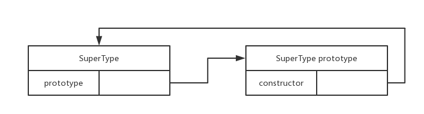
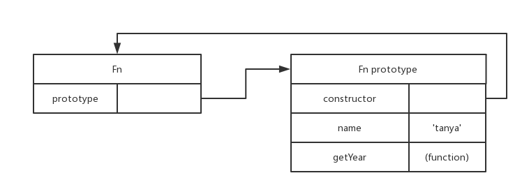
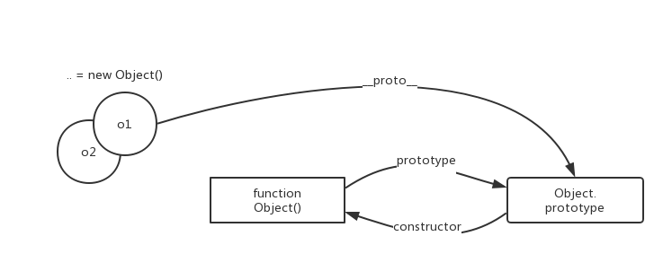
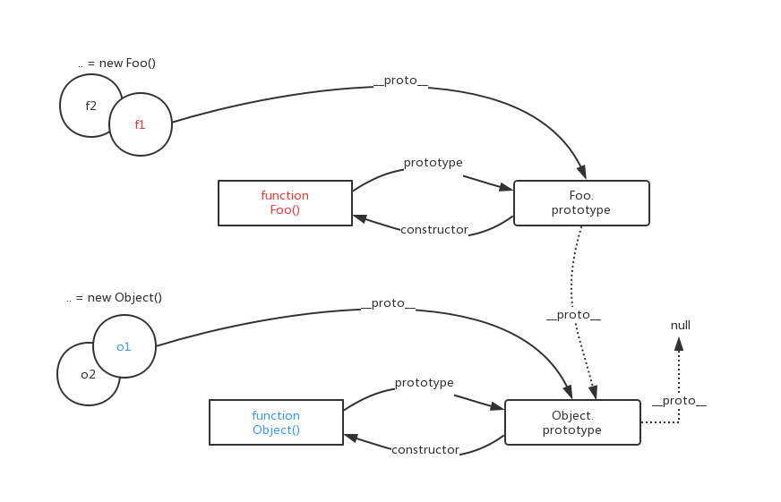
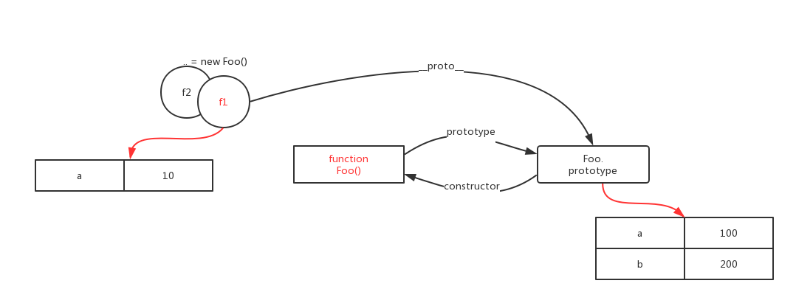
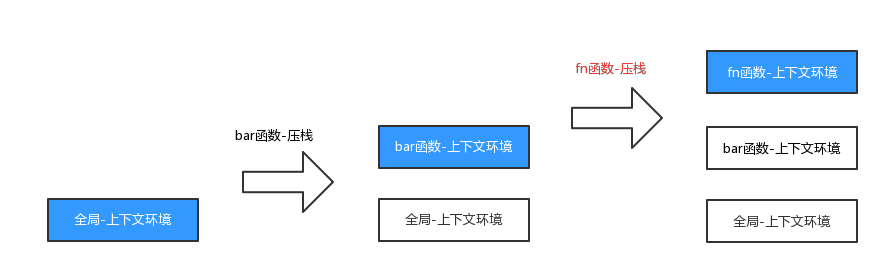
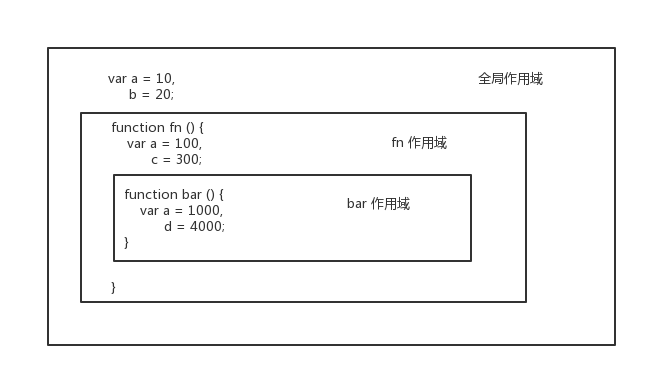
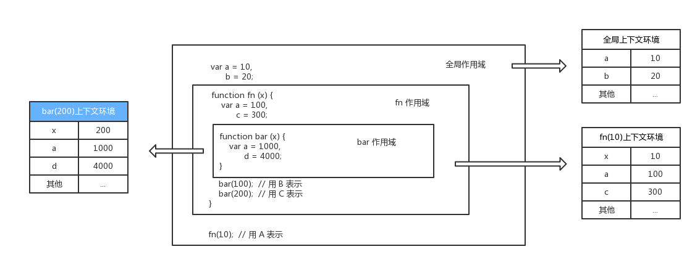
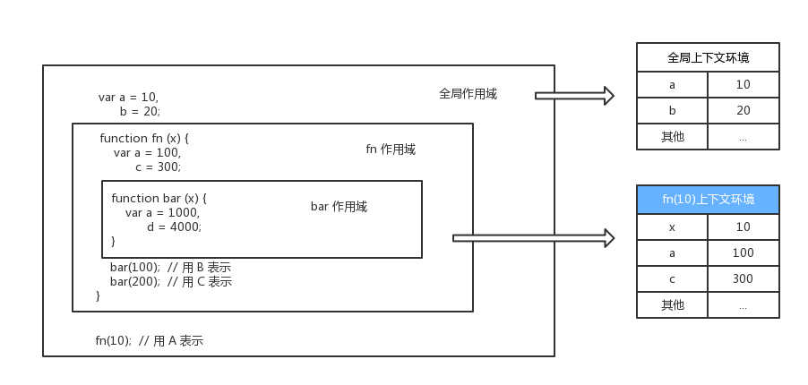
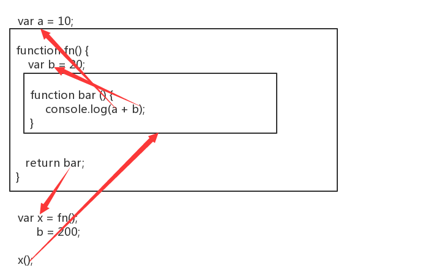

# 深入理解javascript原型和闭包

> [王福朋 - 博客园](http://www.cnblogs.com/wangfupeng1988/) —— 《 [深入理解javascript原型和闭包](http://www.cnblogs.com/wangfupeng1988/p/3977924.html)》

## 目录

<!-- TOC -->

- [深入理解javascript原型和闭包](#%E6%B7%B1%E5%85%A5%E7%90%86%E8%A7%A3javascript%E5%8E%9F%E5%9E%8B%E5%92%8C%E9%97%AD%E5%8C%85)
  - [目录](#%E7%9B%AE%E5%BD%95)
  - [一、一切都是对象](#%E4%B8%80%E4%B8%80%E5%88%87%E9%83%BD%E6%98%AF%E5%AF%B9%E8%B1%A1)
    - [要点1](#%E8%A6%81%E7%82%B91)
    - [1.1 javascript 数据类型](#11-javascript-%E6%95%B0%E6%8D%AE%E7%B1%BB%E5%9E%8B)
    - [1.2 javascript 对象](#12-javascript-%E5%AF%B9%E8%B1%A1)
  - [二、函数和对象的关系](#%E4%BA%8C%E5%87%BD%E6%95%B0%E5%92%8C%E5%AF%B9%E8%B1%A1%E7%9A%84%E5%85%B3%E7%B3%BB)
    - [要点2](#%E8%A6%81%E7%82%B92)
    - [对象是通过函数创建的](#%E5%AF%B9%E8%B1%A1%E6%98%AF%E9%80%9A%E8%BF%87%E5%87%BD%E6%95%B0%E5%88%9B%E5%BB%BA%E7%9A%84)
  - [三、prototype 原型](#%E4%B8%89prototype-%E5%8E%9F%E5%9E%8B)
    - [要点3](#%E8%A6%81%E7%82%B93)
    - [3.1 prototype 和 constructor 属性](#31-prototype-%E5%92%8C-constructor-%E5%B1%9E%E6%80%A7)
    - [3.2 在 prototype 上添加属性](#32-%E5%9C%A8-prototype-%E4%B8%8A%E6%B7%BB%E5%8A%A0%E5%B1%9E%E6%80%A7)
  - [四、隐式原型](#%E5%9B%9B%E9%9A%90%E5%BC%8F%E5%8E%9F%E5%9E%8B)
    - [要点4](#%E8%A6%81%E7%82%B94)
    - [4.1 `__proto__` 属性](#41-proto-%E5%B1%9E%E6%80%A7)
    - [4.2 `Object.prototype` 的 `__proto__`](#42-objectprototype-%E7%9A%84-proto)
    - [4.3 函数的 `__proto__`](#43-%E5%87%BD%E6%95%B0%E7%9A%84-proto)
  - [五、instanceof](#%E4%BA%94instanceof)
    - [要点5](#%E8%A6%81%E7%82%B95)
    - [instanceof 判定](#instanceof-%E5%88%A4%E5%AE%9A)
  - [六、「继承」](#%E5%85%AD%E7%BB%A7%E6%89%BF)
    - [要点6](#%E8%A6%81%E7%82%B96)
    - [6.1 原型链](#61-%E5%8E%9F%E5%9E%8B%E9%93%BE)
    - [6.2 hasOwnProperty](#62-hasownproperty)
  - [七、原型灵活性](#%E4%B8%83%E5%8E%9F%E5%9E%8B%E7%81%B5%E6%B4%BB%E6%80%A7)
  - [八、简述【执行上下文】上](#%E5%85%AB%E7%AE%80%E8%BF%B0%E6%89%A7%E8%A1%8C%E4%B8%8A%E4%B8%8B%E6%96%87%E4%B8%8A)
    - [要点8](#%E8%A6%81%E7%82%B98)
    - [全局执行上下文环境](#%E5%85%A8%E5%B1%80%E6%89%A7%E8%A1%8C%E4%B8%8A%E4%B8%8B%E6%96%87%E7%8E%AF%E5%A2%83)
  - [九、简述【执行上下文】下](#%E4%B9%9D%E7%AE%80%E8%BF%B0%E6%89%A7%E8%A1%8C%E4%B8%8A%E4%B8%8B%E6%96%87%E4%B8%8B)
    - [要点9](#%E8%A6%81%E7%82%B99)
    - [9.1 函数体执行上下文环境](#91-%E5%87%BD%E6%95%B0%E4%BD%93%E6%89%A7%E8%A1%8C%E4%B8%8A%E4%B8%8B%E6%96%87%E7%8E%AF%E5%A2%83)
    - [9.2 自由变量](#92-%E8%87%AA%E7%94%B1%E5%8F%98%E9%87%8F)
    - [9.3 上下文环境](#93-%E4%B8%8A%E4%B8%8B%E6%96%87%E7%8E%AF%E5%A2%83)
  - [十、this](#%E5%8D%81this)
    - [要点10](#%E8%A6%81%E7%82%B910)
    - [10.1 构造函数](#101-%E6%9E%84%E9%80%A0%E5%87%BD%E6%95%B0)
    - [10.2 函数作为对象的一个属性](#102-%E5%87%BD%E6%95%B0%E4%BD%9C%E4%B8%BA%E5%AF%B9%E8%B1%A1%E7%9A%84%E4%B8%80%E4%B8%AA%E5%B1%9E%E6%80%A7)
    - [10.3 函数用 call 或者 apply 调用](#103-%E5%87%BD%E6%95%B0%E7%94%A8-call-%E6%88%96%E8%80%85-apply-%E8%B0%83%E7%94%A8)
    - [10.4 全局 & 普通函数调用（直接调用）](#104-%E5%85%A8%E5%B1%80--%E6%99%AE%E9%80%9A%E5%87%BD%E6%95%B0%E8%B0%83%E7%94%A8%E7%9B%B4%E6%8E%A5%E8%B0%83%E7%94%A8)
    - [10.5 bind() 对直接调用的影响（新增）](#105-bind-%E5%AF%B9%E7%9B%B4%E6%8E%A5%E8%B0%83%E7%94%A8%E7%9A%84%E5%BD%B1%E5%93%8D%E6%96%B0%E5%A2%9E)
    - [10.6 箭头函数中的 this（新增）](#106-%E7%AE%AD%E5%A4%B4%E5%87%BD%E6%95%B0%E4%B8%AD%E7%9A%84-this%E6%96%B0%E5%A2%9E)
  - [十一、执行上下文栈](#%E5%8D%81%E4%B8%80%E6%89%A7%E8%A1%8C%E4%B8%8A%E4%B8%8B%E6%96%87%E6%A0%88)
    - [要点11](#%E8%A6%81%E7%82%B911)
    - [11.1 执行上下文栈概念](#111-%E6%89%A7%E8%A1%8C%E4%B8%8A%E4%B8%8B%E6%96%87%E6%A0%88%E6%A6%82%E5%BF%B5)
    - [11.2 压栈、出栈过程](#112-%E5%8E%8B%E6%A0%88%E5%87%BA%E6%A0%88%E8%BF%87%E7%A8%8B)
  - [十二、简介【作用域】](#%E5%8D%81%E4%BA%8C%E7%AE%80%E4%BB%8B%E4%BD%9C%E7%94%A8%E5%9F%9F)
    - [要点12](#%E8%A6%81%E7%82%B912)
    - [作用域](#%E4%BD%9C%E7%94%A8%E5%9F%9F)
  - [十三、【作用域】和【上下文环境】](#%E5%8D%81%E4%B8%89%E4%BD%9C%E7%94%A8%E5%9F%9F%E5%92%8C%E4%B8%8A%E4%B8%8B%E6%96%87%E7%8E%AF%E5%A2%83)
    - [要点13](#%E8%A6%81%E7%82%B913)
    - [作用域结合上下文环境](#%E4%BD%9C%E7%94%A8%E5%9F%9F%E7%BB%93%E5%90%88%E4%B8%8A%E4%B8%8B%E6%96%87%E7%8E%AF%E5%A2%83)
  - [十四、从【自由变量】到【作用域链】](#%E5%8D%81%E5%9B%9B%E4%BB%8E%E8%87%AA%E7%94%B1%E5%8F%98%E9%87%8F%E5%88%B0%E4%BD%9C%E7%94%A8%E5%9F%9F%E9%93%BE)
    - [要点14](#%E8%A6%81%E7%82%B914)
    - [14.1 自由变量](#141-%E8%87%AA%E7%94%B1%E5%8F%98%E9%87%8F)
    - [14.2 作用域链](#142-%E4%BD%9C%E7%94%A8%E5%9F%9F%E9%93%BE)
  - [十五、闭包](#%E5%8D%81%E4%BA%94%E9%97%AD%E5%8C%85)
    - [要点15](#%E8%A6%81%E7%82%B915)
    - [15.1 闭包产生的条件](#151-%E9%97%AD%E5%8C%85%E4%BA%A7%E7%94%9F%E7%9A%84%E6%9D%A1%E4%BB%B6)
    - [15.2 常见的闭包](#152-%E5%B8%B8%E8%A7%81%E7%9A%84%E9%97%AD%E5%8C%85)
    - [15.3 闭包作用域](#153-%E9%97%AD%E5%8C%85%E4%BD%9C%E7%94%A8%E5%9F%9F)
  - [十六、总结](#%E5%8D%81%E5%85%AD%E6%80%BB%E7%BB%93)
    - [文章说明](#%E6%96%87%E7%AB%A0%E8%AF%B4%E6%98%8E)
    - [文章初衷](#%E6%96%87%E7%AB%A0%E5%88%9D%E8%A1%B7)
    - [文章反馈](#%E6%96%87%E7%AB%A0%E5%8F%8D%E9%A6%88)
    - [文章后续](#%E6%96%87%E7%AB%A0%E5%90%8E%E7%BB%AD)

<!-- /TOC -->

## 一、一切都是对象

> 原文链接：[http://www.cnblogs.com/wangfupeng1988/p/3977987.html]((http://www.cnblogs.com/wangfupeng1988/p/3977987.html))

### 要点1

一切（引用类型）都是对象，对象是属性的集合。

### 1.1 javascript 数据类型

```javascript
function show(x) {

    console.log(typeof x);                  // undefined
    console.log(typeof 10);                 // number
    console.log(typeof 'abc');              // string
    console.log(typeof true);               // boolean

    console.log(typeof function () {});     //function

    console.log(typeof [1, 'a', true]);     //object
    console.log(typeof { a: 10, b: 20 });   //object
    console.log(typeof null);               //object
    console.log(typeof new Number(10));     //object
}

show();
```

值类型（不是对象）：undefined, number, string, boolean

引用类型（是对象）：函数，数组，对象，null, new Number(10)

值类型和引用类型的类型判断方式：

* 值类型的类型判断用 typeof
* 引用类型的类型判断使用 instanceof

```javascript
var fn = function () {};
console.log(fn instanceof Object);  // true
```

**[⬆ back to top](#目录)**

### 1.2 javascript 对象

定义：若干属性的集合（只有属性，没有方法，方法也是一种属性）

```javascript
var obj = {
    a: 10,
    b: function (x) {
        alert(this.a + x)
    },
    c: {
        name: 'tanya',
        year: 1975
    }
}
```

函数也是一种对象（可以定义属性）：

```javascript
var fn = function () {
    alert(100);
};

fn.a = 10;
fn.b = function () {
    alert(123);
};
fn.c = {
    name: 'tanya',
    year: 1975
}
```

数组也是一种对象（本身就存在 `length` 属性）：

```javascript
var arr = [1, 2, 3];
console.log(arr.length); // 3

arr.a = 'tanya';
arr.b = function () {
    alert(123);
}
arr.c = {
    name: 'tanya',
    year: 1975
}

for (var item in arr) {
    console.log(item) // 0 1 a b c
}
```

## 二、函数和对象的关系

> 原文链接：[http://www.cnblogs.com/wangfupeng1988/p/3978035.html]((http://www.cnblogs.com/wangfupeng1988/p/3978035.html))

### 要点2

对象是通过函数创建的，而函数又是一种对象。

### 对象是通过函数创建的

```javascript
function Fn () {
    this.name = 'tanya';
    this.age = 1975;
}

var fn = new Fn(); // 说 fn 是对象，因为它有属性
console.log(fn.name)  // tanya
console.log(fn.age)   // 1975
```

通过字面量创建对象或数组：

```javascript
var obj = { a: 10, b: 20 };
var arr = [5, 'x', true];
```

等效于

 ```javascript
 var obj = new Object();
 obj.a = 10;
 obj.b = 20;

var arr = new Array();
arr[0] = 5;
arr[1] = 'x';
arr[2] = true;
 ```

 其中 Object 和 Array 是函数：

 ```javascript
 console.log(typeof Object);  // function
 console.log(typeof Array);   // function
 ```

## 三、prototype 原型

> 原文链接：[http://www.cnblogs.com/wangfupeng1988/p/3978131.html]((http://www.cnblogs.com/wangfupeng1988/p/3978131.html))

什么是原型？

函数都有一个 prototype 属性，它是一个对象，

函数的实例对象的 `__proto__` 属性指向该函数的 prototype 属性，

那我们称该对象为函数实例对象的原型

**[⬆ back to top](#目录)**

### 要点3

理解原型概念。

### 3.1 prototype 和 constructor 属性

函数有一个默认属性 `prototype`，属性值是一个对象，该对象默认只有一个 `constructor` 属性，指向这个函数本身。



如上图：SuperType 是一个函数，右侧的方框就是它的原型。

Object 原型里面有几个其他属性：


### 3.2 在 prototype 上添加属性

```javascript
function Fn() {}
Fn.prototype.name = 'tanya'
Fn.prototype.getYear = function () {
    return 1975;
};
```



**[⬆ back to top](#目录)**

## 四、隐式原型

> 原文链接：[http://www.cnblogs.com/wangfupeng1988/p/3979290.html]((http://www.cnblogs.com/wangfupeng1988/p/3979290.html))

每个函数都有一个 `prototype` 属性，即原型。每个对象都有一个 `__proto__`，可称为隐式原型。

### 要点4

理解隐式原型 `__proto__`。

### 4.1 `__proto__` 属性

关于 `__proto__` 属性说明：是一个隐藏属性，低版本浏览器不支持该属性。

```javascript
var obj = {};
console.log(obj.__proto__);
console.log(Object.prototype);
console.log(obj.__proto__ === Object.prototype);
```

以上代码说明：每个对象都有一个 `__proto__`属性，指向创建该对象（这里是 obj）的函数（这里是 Object）的 prototype。



### 4.2 `Object.prototype` 的 `__proto__`

自定义函数的 prototype：本质和 `var obj = {}` 是一样的，都是被 `Object` 创建的，所以它的 `__proto__` 指向的就是 `Object.prototype`。



`Object.prototype` 是一个特例——它的 `__proto__` 指向的是 null。

### 4.3 函数的 `__proto__`

函数也是一种对象，所以函数也有 `__proto__` 属性。至于函数的 `__proto__` 是什么，还是要看函数是被谁创建的。

```javascript
function fn(x, y) {
    return x + y;
}
console.log(fn(10, 20));  // 30

// 等价于

var fn = new Function('x', 'y', 'return x + y;');
console.log(fn(5, 6));  // 11
```

函数是被 `Function` 创建的。

上面有说过：对象的 `__proto__` 指向的是创建它的函数的 `prototype`，则会有 `Object.__proto__ === Function.prototype`。

解释一下：这里 Object 是一个函数，被 Function 所创建，函数也是一种对象，所以 Object 有 `__proto__` 属性，指向创建它（Object）的函数（Function）的原型


上图中，自定义函数的 `Foo.__proto__` 指向 `Function.prototype`，`Object.__proto__` 指向 `Function.prototype`，还有一个`Function.__proto__` 指向 `Function.prototype`。

如何理解 `Function.__proto__` 指向 `Function.prototype`？

`Function` 是一个函数，函数是一种对象，对象有 `__proto__` 属性。 既然是函数，那么是被 `Function` 创建的，也就是 `Function` 是被自身创建的。对象的 `__proto__` 指向创建它的函数的 `prototype`，所以 `Function` 的 `__proto__` 指向了自身的 `prototype`。

**[⬆ back to top](#目录)**

## 五、instanceof

> 原文链接：[http://www.cnblogs.com/wangfupeng1988/p/3979290.html]((http://www.cnblogs.com/wangfupeng1988/p/3979290.html))

### 要点5

instanceof 判定规则。

### instanceof 判定

语法是 `A instanceof B`，A是对象，B一般是一个函数。

instanceof 判断规则：沿着 A 的 `__proto__` 这条线来找，如果能找到与 `B.prototype` 相等的同一个引用，即同一个对象，就返回 true。如果找到终点（`Object.prototype.__proto__`）还未重合，则返回 false。

代码实现：

```javascript
function instance_of(L, R) { // L 表示左表达式，R 表示右表达式
    var O = R.prototype; // 取 R 的显示原型
    L = L.__proto__; // 取 L 的隐式原型
    while (true) {
        if (L === null){
            return false;
        }
        if (O === L) { // 这里重点：当 O 严格等于 L 时，返回 true
            return true;
        }
        L = L.__proto__;
    }
}
```


根据上图及 instanceof 判定规则理解：

```javascript
console.log(Object instanceof Function);  // true
console.log(Function instanceof Object);  // true
console.log(Function instanceof Function);  // true
```

**[⬆ back to top](#目录)**

## 六、「继承」

> 原文链接：[http://www.cnblogs.com/wangfupeng1988/p/3979985.html]((http://www.cnblogs.com/wangfupeng1988/p/3979985.html))

### 要点6

1. 理解原型链概念
1. 知道属性查找方式

### 6.1 原型链

javascript 中的继承是通过原型链来体现的。

当访问一个对象的属性时，先在基本属性（自身属性）中查找，如果没有，再沿着 `__proto__` 这条链向上找，直到 `Object.prototype.__proto__`，如果还没找到就返回 undefined，这条在原型上查找的链称为原型链。

```javascript
function Foo() {}
var f1 = new Foo();

f1.a = 10;

Foo.prototype.a = 100;
Foo.prototype.b = 200;

console.log(f1.a);  // 10
console.log(f1.b);  // 200
```



### 6.2 hasOwnProperty

通过 hasOwnProperty 方法可以判断属性是基本的（自身）还是从原型中找到的。

```javascript
function Foo() {}
var f1 = new Foo();

f1.a = 10;

Foo.prototype.a = 100;
Foo.prototype.b = 200;

for (var item1 in f1) {
    if (f1.hasOwnProperty(item1)) { // 只打印自身属性
        console.log(item1);  // a
    }
}

for (var item2 in f1) {
    console.log(item2); // a b
}
```

那么 hasOwnProperty 有是在哪来的呢？它是在 Objec.prototype 中定义的。


对象的原型链是沿着 `__proto__` 这条线走的，因此在查找 `f1.hasOwnProperty` 属性时，就会顺着原型链一直查找到 Object.prototype。

每个函数都有 call, bind 方法，都有 length, arguments, caller 等属性。这也是“继承”的。函数是由 Function 函数创建，`__proto__` 属性指向 Function.prototype，因此继承 Function.prototype 中的方法。

**[⬆ back to top](#目录)**

## 七、原型灵活性

> 原文链接：[http://www.cnblogs.com/wangfupeng1988/p/3980065.html]((http://www.cnblogs.com/wangfupeng1988/p/3980065.html))

偶不想表^_^。

**[⬆ back to top](#目录)**

## 八、简述【执行上下文】上

> 原文链接：[http://www.cnblogs.com/wangfupeng1988/p/3986420.html]((http://www.cnblogs.com/wangfupeng1988/p/3986420.html))

### 要点8

理解全局执行上下文环境。

### 全局执行上下文环境

在 javascript 代码执行之前，浏览器会做一些“准备工作”，其中包括对变量的声明，而不是赋值。变量赋值是在赋值语句执行的时候进行的。

* 变量、函数表达式——变量声明，默认赋值为undefined；
* this——赋值；
* 函数声明——赋值；

这三种数据的准备情况我们称之为“执行上下文”或者“执行上下文环境”。

其实，javascript 在执行一个“代码段”之前，都会进行这些“准备工作”来生成执行上下文。这个“代码段”分为三种情况——全局代码、函数体、eval代码。

为什么“代码段”分为这三种？

代码段就是一段文本形式的代码。首先，全局代码是一种，本来就是手写文本到 `<script>` 标签里面的。

```javascript
<script>
    // 代码段
</script>
```

其次，eval 代码接受的也是一段文本形式的代码。

```javascript
eval('alert(123)')
```

最后，函数体是因为函数在创建时，本质上是 `new Function(...)` 得到的，其中需要传入一个文本形式的参数作为函数体。

```javascript
function fn(x) {
    console.log(x + 5);
}

var fn = new Function('x', 'console.log(x + 5)');
```

**[⬆ back to top](#目录)**

## 九、简述【执行上下文】下

> 原文链接：[http://www.cnblogs.com/wangfupeng1988/p/3987563.html]((http://www.cnblogs.com/wangfupeng1988/p/3987563.html))

### 要点9

1. 理解执行上下文环境
1. 知道什么是自由变量
1. 上下文的准备工作及区别（全局与函数）

### 9.1 函数体执行上下文环境

```javascript
function fn(x) {
    console.log(arguments);  // [10]
    console.log(x);  // 10
}
fn(10);
```

在函数体的语句执行之前，arguments 变量和函数参数都已经被赋值。函数每调用一次都会产生一个新的执行上下文环境，因为不同的调用可能会有不同的参数。

### 9.2 自由变量

自由变量：当前作用域内使用了外部作用域的变量（使用了不是在当前作用域内定义的变量）。

函数在定义的时候（不是调用的时候），就已经确定了函数体内部自由变量的作用域。

```javascript
var a = 10;
function fn() {
    console.log(a); // a 是自由变量，函数创建时，就确定了 a 要取值的作用域
}

function bar(f) {
    var a = 20;
    f(); // 打印 10, 而不是 20
}
bar(fn);
```

### 9.3 上下文环境

全局代码的上下文环境数据内容为：


| 准备内容                                     | 初始化                       |
| -------------------------------------------- | ---------------------------- |
| 普通变量（包括函数表达式），如： var a = 10; | 声明（默认赋值为 undefined） |
| 函数声明， 如： function fn() { }            | 赋值                         |
| this                                         | 赋值                         |

如果代码段是函数体，那么需要在此（全局准备内容）基础上附加：

| 准备内容             | 初始化 |
| -------------------- | ------ |
| 参数                 | 赋值   |
| arguments            | 赋值   |
| 自由变量的取值作用域 | 赋值   |

通俗执行上下文环境定义：在执行代码之前，把将要用到的所有的变量都事先拿出来，有的直接赋值了，有的先用 undefined 占个空。

**[⬆ back to top](#目录)**

## 十、this

> 原文链接：[http://www.cnblogs.com/wangfupeng1988/p/3988422.html]((http://www.cnblogs.com/wangfupeng1988/p/3988422.html))
>
> 新增参考：http://mp.weixin.qq.com/s/xMLZLQzb2CBvkB7HkiNzSA

### 要点10

1. 掌握 this 的几种指向问题。
1. 函数中 this 取值是在函数被调用的时候确定的，而不是在定义时。

### 10.1 构造函数

所谓构造函数就是用来 new 对象的函数。严格来说，所有函数都可以 new 一个对象，但是有些函数的定义不是为了作为构造函数。另外注意，构造函数的函数名第一个字母大写（规则约定）。例如：Object, Array, Function 等。

```javascript
function Foo() {
    this.name = 'tanya';
    this.year = 1975;

    console.log(this);  // Foo { name: 'tanya', year: 1975 }
}

var f1 = new Foo();
console.log(f1.name);  // tanya
console.log(f1.year);  // 1975
```

以上代码中，如果函数作为构造函数用，那么其中 this 就代表它即将 new 出来的对象， 这里 this 表示 f1。

### 10.2 函数作为对象的一个属性

如果函数作为对象的一个属性时，并且作为对象的一个属性被调用时，函数中的 this 指向该对象。

```javascript
var obj = {
    x: 10,
    fn: function() {
        console.log(this);    //  Object { x: 10, fn: function }
        console.log(this.x);  // 10
    }
}

obj.fn();
```

如果 fn 函数不是作为 obj 的一个属性被调用，会是什么结果？

```javascript
var obj = {
    x: 10,
    fn: function() {
        console.log(this);    //  Window {top: Window, ...}
        console.log(this.x);  // undefined
    }
}

var fn1 = obj.fn;
fn1();
```

如上代码，如果 fn 函数被赋值到了另一个变量中，并没有作为 obj 的一个属性被调用，那么 this 的值就是 window，this.x 为 undefined。

### 10.3 函数用 call 或者 apply 调用

当一个函数被 call 或 apply 调用时，this 的值就取传入的对象的值。

```javascript
var obj = {
    x: 10
};

var fn = function() {
    console.log(this);  // Object {x: 10}
    console.log(this.x);
}

fn.call(obj);
```

### 10.4 全局 & 普通函数调用（直接调用）

在全局环境下，this 永远是 window：

```javascript
console.log(this === window);  // true
```

普通函数在调用时，其中 this 也是 window：

```javascript
var x = 10;

var fn = function() {
    console.log(this);    // Window {top: Window ...}
    console.log(this.x);  // 10
}

fn();
```

注意下面的情况：

```javascript
var obj = {
    x: 10,
    fn: function() {
        function f() {
            console.log(this);    // Window {top: Window ...}
            console.log(this.x);  // 10
        }
        f();
    }
};

obj.fn();
```

虽然函数 f 是在 `obj.fn` 内部定义的，但它仍然是一个普通函数，this 指向 window。

### 10.5 bind() 对直接调用的影响（新增）

`Function.prototype.bind()` 的作用是将当前函数与指定对象绑定，并返回一个新函数，这个函数无论以什么样的方式调用，其 this 始终指向绑定的对象。

```javascript
var obj = {};
function test() {
    console.log(this === obj);
}

var testObj = test.bind(obj);
test(); // false
testObj(); // true
```

### 10.6 箭头函数中的 this（新增）

箭头函数没有自己的 this 绑定。箭头函数中使用的 this，指的是直接包含它的那个函数或函数表达式中的 this。

```javascript
var obj = {
    test: function () {
        var arrow = () => {
            console.log(this === obj);
        }

        arrow();
    }
}

obj.test(); // true
// 这里 arrow 函数中的 this 指的是 test 函数中的 this，
// 而 test 函数中的 this 指的是 obj
```

> 另外需要注意的是，箭头函数不能用 new 调用，不能 bind() 到某个对象(虽然 bind() 方法调用没问题，但是不会产生预期效果)。不管在什么情况下使用箭头函数，它本身是没有绑定 this 的，它用的是直接外层函数(即包含它的最近的一层函数或函数表达式)绑定的 this。

**[⬆ back to top](#目录)**

## 十一、执行上下文栈

> 原文链接：[http://www.cnblogs.com/wangfupeng1988/p/3989357.html]((http://www.cnblogs.com/wangfupeng1988/p/3989357.html))

### 要点11

1. 理解执行上下文栈概念
2. 了解压栈、出栈过程。

### 11.1 执行上下文栈概念

执行全局代码时，会产生一个执行上下文环境，每次调用函数都又会产生执行上下文环境。当函数调用完成时，这个上下文环境以及其中的数据都会被清除，再重新回到全局上下文环境。处于活动状态的执行上下文环境只有一个。

可以把这看成是一个压栈出栈的过程，俗称执行上下文栈。

> 蓝色背景表示活动状态
>
> 白色背景表示非活动状态


### 11.2 压栈、出栈过程

```js
var a = 10,                         // 1、进入全局上下文环境
    fn,
    bar = function(x) {
        var b = 5;
        fn(x+b);// 用 B 表示        // 3、进入 fn 函数上下文环境
    }

fn = function(y) {
    var c = 5;
    console.log(y + c);
}
// 用 A 表示
bar(10);                           // 2、进入 bar 函数上下文环境
```

第一步：在代码执行之前，首先创建全局上下文环境：

全局上下文环境（全局代码执行前）

| 变量 | 赋值      |
| ---- | --------- |
| a    | undefined |
| fn   | undefined |
| bar  | undefined |
| this | window    |

然后是代码执行，执行到 A 之前，全局上下文环境中的变量都在执行过程中被赋值：

全局上下文环境变为

| 变量 | 赋值     |
| ---- | -------- |
| a    | 10       |
| fn   | function |
| bar  | function |
| this | window   |

第二步：执行到 A 之后，调用 bar 函数。

跳转到 bar 函数内部，执行函数体语句之前，会创建一个新的执行上下文环境：

bar 函数执行上下文环境

| 变量      | 赋值      |
| --------- | --------- |
| b         | undefined |
| x         | 10        |
| arguments | [10]]     |
| this      | window    |

 并将这个执行上下文环境压栈，设置为活动状态：

 

第三步：执行到 B，又调用了 fn 函数，在执行函数体语句之前，会创建 fn 函数的执行上下文环境，并压栈，设置为活动状态：

 

第四步：待 B 执行完毕，即 fn 函数执行完毕后，此次调用 fn 所生成的上下文环境出栈，并且被销毁（已经用完了，就要及时销毁，释放内存）。

 

第五步：同理，待 A 执行完毕，即 bar 函数执行完毕后，调用 bar 函数所生成的上下文环境出栈，并且被销毁（已经用完了，就要及时销毁，释放内存）。

 

**[⬆ back to top](#目录)**

## 十二、简介【作用域】

> 原文链接：[http://www.cnblogs.com/wangfupeng1988/p/3991151.html]((http://www.cnblogs.com/wangfupeng1988/p/3991151.html))
>
> 参考：https://github.com/mqyqingfeng/Blog/issues/3

### 要点12

理解作用域。

### 作用域

作用域是个很抽象的概念，类似于一个“地盘”。

 

上图中，全局代码和 fn 、bar 两个函数都会形成一个作用域。

在作用域中存在上下级关系，上下级关系的确定就看函数是在哪个作用域下创建的。例如：fn 作用域下创建了 bar 函数，那么 “fn 作用域” 就是 “bar 作用域” 的上级。

作用域最大的用处就是隔离变量，不同作用域下同名变量不会有冲突。例如以上代码中，三个作用域下都声明了“a” 这个变量，但是他们不会有冲突。各自作用域下，用各自的“a”。

**[⬆ back to top](#目录)**

## 十三、【作用域】和【上下文环境】

> 原文链接：[http://www.cnblogs.com/wangfupeng1988/p/3991995.html]((http://www.cnblogs.com/wangfupeng1988/p/3991995.html))

### 要点13

理解作用域和上下文环境。

### 作用域结合上下文环境

 

除了全局作用域外，每个函数都会创建自己的作用域，作用域在函数定义时就已经确定了，而不是在函数调用时确定的。

下面按照程序执行的顺序，一步一步加上上下文环境：

第一步，在加载程序时，就已经确定了全局上下文环境，并随着程序的执行而对变量赋值：

 

第二步，程序执行到 A ，调用 fn(10) ，此时生成此次调用 fn 函数时的上下文环境，压栈，并将此上下文环境设置为活动状态。

 

第三步，执行到 B 时，调用 bar(100) ，生成此次调用的上下文环境，压栈，并设置为活动状态。

 

第四步，执行完 B ，bar(100) 调用完成。则 bar(100) 上下文环境被销毁。接着执行 C，调用 bar(200)，则又生成 bar(200 )的上下文环境，压栈，设置为活动状态。

 

第五步，执行完 C ，则 bar(200) 调用结束，其上下文环境被销毁。此时会回到 fn(10) 上下文环境，变为活动状态。

 

第六步，执行完 A，fn(10) 执行完成之后，fn(10) 上下文环境被销毁，全局上下文环境又回到活动状态。

 

最后把以上过程连起来看看：


作用域只是一个“地盘”，一个抽象的概念，其中没有变量，要通过作用域对应的执行上下文环境来获取变量的值。同一个作用域下，不同的调用会产生不同的执行上下文环境，继而产生不同变量的值。所以，作用域中变量的值是在执行过程中产生的确定的，而作用域却是在函数创建时就确定了。

所以，如果要找一个作用域下某个变量的值，就需要找到这个作用域对应的执行上下文环境，再在其中寻找变量的值。

**[⬆ back to top](#目录)**

## 十四、从【自由变量】到【作用域链】

> 原文链接：[http://www.cnblogs.com/wangfupeng1988/p/3992795.html]((http://www.cnblogs.com/wangfupeng1988/p/3992795.html))

### 要点14

理解作用域链。

### 14.1 自由变量

什么是自由变量？

在 A 作用域中使用变量 x，却没有在 A 作用域中声明（在其他作用域中声明的），对于 A 作用域来说，x就是一个自由变量。

如下：

```javascript
var x = 10;

function fn() {
    var b = 20;
    console.log(x + b); // x 在这里就是一个自由变量
}
```

那么，在 fn 函数中，取自由变量 x 的值时，要到哪个作用域中去取？——要到创建 fn 函数的那个作用域中取。无论 fn 函数在哪里调用。

### 14.2 作用域链

作用域链：在当前作用域中进行查找，如果没有，就在创建函数作用域中查找自由变量，如果没有，就去创建该作用域的函数所在作用域查找，直到全局作用域为止。这个在作用域中查找的路线，称之为作用域链。

我们拿文字总结一下取自由变量时的这个“作用域链”过程：（假设a是自由量）

第一步，现在当前作用域查找a，如果有则获取并结束。如果没有则继续；

第二步，如果当前作用域是全局作用域，则证明a未定义，结束；否则继续；

第三步，（不是全局作用域，那就是函数作用域）将创建该函数的作用域作为当前作用域；

第四步，跳转到第一步。

示例代码：



以上代码中：fn() 返回的是 bar 函数 ，赋值给 x 。执行 x()，即执行 bar 函数代码。取 b 的值时，直接在 fn 作用域取出。取 a 的值时，试图在 fn 作用域取，但是取不到，只能转向创建 fn 的那个作用域中去查找，结果找到了。

**[⬆ back to top](#目录)**

## 十五、闭包

> 原文链接：[http://www.cnblogs.com/wangfupeng1988/p/3992795.html]((http://www.cnblogs.com/wangfupeng1988/p/3992795.html))
>
> 参考：https://stackoverflow.com/questions/111102/how-do-javascript-closures-work

### 要点15

1. 知道闭包产生的条件及常见用法
1. 理解闭包是什么

### 15.1 闭包产生的条件

1. 函数嵌套
1. 内部函数引用了外部函数的数据（可以是变量或者函数）

换句话说：简单地访问函数的词法作用域（静态作用域）以外的自由变量会创建一个闭包。

```javascript
function fn () { // 外部函数
    var max = 10;

    function bar (x) { // 内部函数
        if (x > max) { // 引用了外部函数变量 max
            console.log(x)
        }
    }
}

fn()
```


说明：红色框中，收起部分为 `object: { max: undefined }`

那么，闭包到底是什么？

闭包是包含被内部函数引用的在外部函数中定义的数据的对象（可以是变量或者函数）。简单点说是：包含被引用变量（函数）的对象

### 15.2 常见的闭包

1. 将函数作为另一个函数的返回值（函数不必为了被称为闭包而返回，看看闭包产生的条件）
1. 将函数作为实参传递给另一个函数调用

> 将函数作为另一个函数的返回值

```javascript
function fn () {
    var max = 10;

    function bar () {
        return max++;
    }

    return bar; // 作为另一个函数的返回值
}

var bar = fn();
console.log(bar()); // 10
console.log(bar()); // 11
console.log(bar()); // 12
```

从中我们可以看出闭包的作用：

1. 使函数内部的变量 `max` 在函数 `fn` 执行完后，让然存活在内存中（其他变量已经释放）
2. 让函数 `fn` 外部可以读取到函数内部的数据 `max`（变量或者函数）

也可以看出闭包的缺点：

> 内存泄漏（Memory Leak）是指程序中己动态分配的堆内存由于某种原因程序未释放或无法释放，造成系统内存的浪费，导致程序运行速度减慢甚至系统崩溃等严重后果。
——百度百科

1. 函数 `fn` 执行完之后，被函数 `bar` 引用的变量没有释放，占用内存时间会变长
1. 可能造成内存泄漏（memory leaks）

那对应的解决方案是：

只需要在不使用函数时，置空就行了 `bar = null;`

> 将函数作为实参传递给另一个函数调用

```javascript
function fn () {
    var max = 1;
    var interval;
    interval = setInterval(function () { // 将匿名函数作为 setInterval 函数的参数调用
        if (max > 100) clearInterval(interval)
        console.log(max++);
    }, 1000)
}

fn();
```


注意图中 `Closure (fn)`，fn 指的是查找引用变量时的作用域。

### 15.3 闭包作用域

> 代码一

```javascript
function fn () { // Closure (fn) { x: 1 }
    var x = 1;
    function foo () { // Closure (foo) { y: 2 }
        var y = 2;
        console.log(x + y)
        return function bar () {
            var z = 3;
            console.log(x + y + z)
        }
    }
}

var foo = fn();
var bar = foo();
bar();
```


从上图中可以看到，闭包所在作用域平行于引用变量（x, y）所在的作用域。

> 代码二（继续说明闭包所在作用域）

```javascript
function fn () {
    var x = 1;
    function foo () {
        console.log(x++);
    }

    function bar () {
        console.log(x++);
    }

    return {
        foo: foo,
        bar: bar
    }
}

var o = fn();
var foo = o.foo;
var bar = o.bar;

foo(); // x: 1
bar(); // x: 2
```


从代码输出可以看到，闭包并不是属于某一个内部函数，也恰好印证了上面说的。

**[⬆ back to top](#目录)**

## 十六、总结

### 文章说明

> 感谢王福朋

内容绝大部分来自[王福朋 - 博客园](http://www.cnblogs.com/wangfupeng1988/) —— 《 [深入理解javascript原型和闭包](http://www.cnblogs.com/wangfupeng1988/p/3977924.html)
》，我只是重画了大部分的图和对少量内容进行了补充（比如：this 章节的“新增”、闭包部分）

### 文章初衷

希望在一篇文章中进行概括说明这些内容（并不是说分开不好），只是这样读起来更加顺畅，找起来比较方便（离线也可以哦，已上传到 [Github](https://github.com/savoygu/blog/)上，欢迎 star、fork）；

自己也可以针对相关内容进行扩充（不用看到一些额外的相关知识就收藏一个网址^_^，你也可以把这篇文章转到你的账号下，进行扩充，说明来源即可）；

### 文章反馈

如有错误，欢迎指出；

如有疑问，欢迎讨论；

### 文章后续

如果看到相关的新的知识，会添加到对应主题下面（以“新增”标明）；

如果你看到这里没有提到的相关内容，也可以给我链接，我会进行补充，并贴上你的大名；

撒花，待续，期待你们的加入……

**[⬆ back to top](#目录)**
