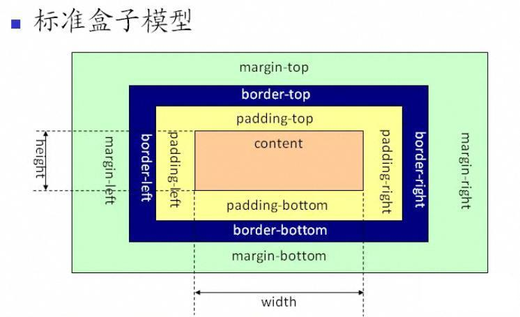
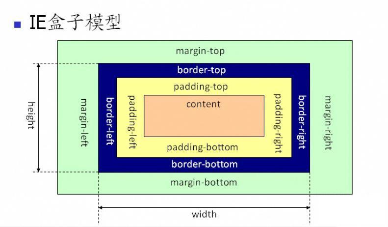

## CSS 盒模型

### 块级盒子（Block box）和内联盒子（Inline box）

在 CSS 中会广泛地使用两种“盒子” —— **块级盒子 (block box)** 和 **内联盒子 (inline box)**。这两种盒子会在**页面流**（page flow）和**元素之间的关系**方面表现出不同的行为：

一个被定义为块级的盒子会表现出以下行为：

- 盒子会在内联的方向上扩展并占据父容器在该方向上的所有可用空间，在绝大数情况下意味着盒子会和父容器一样宽
- 每个盒子都会换行
- `width` 和 `height` 属性可以发挥作用
- 内边距（padding）, 外边距（margin） 和 边框（border） 会将其他元素从当前盒子周围“推开”

除非特殊指定，诸如标题(`<h1>`等)和段落(`
`)默认情况下都是块级的盒子。

如果一个盒子对外显示为 `inline`，那么它的行为如下:

- 盒子不会换行
- `width` 和 `height` 属性将不起作用
- 垂直方向的内边距、外边距以及边框会被应用但是不会把其他处于 `inline` 状态的盒子推开。
- 水平方向的内边距、外边距以及边框会被应用且会把其他处于 `inline` 状态的盒子推开

用做链接的 `<a>` 元素、 ``、 `<em>` 以及 `<strong>` 都是默认处于 `inline` 状态的。

可以通过对盒子 `display` 属性的设置，比如 `inline` 或者 `block` ，来控制盒子的外部显示类型。

#### 扩展：`display: inline-block`

display 有一个特殊的值，它在内联和块之间提供了一个中间状态。这对于以下情况非常有用: 您不希望一个项切换到新行，但希望它可以设定宽度和高度，并避免上面看到的重叠。

一个元素使用 display: inline-block，实现我们需要的块级的部分效果：

- 设置 width 和 height 属性会生效。
- padding, margin, 以及 border 会推开其他元素。

但是，它不会跳转到新行，如果显式添加 width 和 height 属性，它只会变得比其内容更大。

### 什么是 CSS 盒模型？

完成的 CSS 盒模型应用于块级盒子，内联盒子只使用盒模型中定义的部分内容。模型定义了盒的每个部分 —— margin, border, padding, and content —— 合在一起就可以创建我们在页面上看到的内容。

### 盒模型的各个部分

CSS 中组成一个块级盒子需要:

- **Content box**: 这个区域是用来显示内容，大小可以通过设置 `width` 和 `height`.
- **Padding box**: 包围在内容区域外部的空白区域； 大小通过 `padding` 相关属性设置。
- **Border box**: 边框盒包裹内容和内边距。大小通过 `border` 相关属性设置。
- **Margin box**: 这是最外面的区域，是盒子和其他元素之间的空白区域。大小通过 `margin` 相关属性设置。

### 盒模型模型

默认浏览器会使用**标准模型**。如果需要使用替代模型，您可以通过为其设置 `box-sizing: border-box` 来实现。

#### 标准盒模型（W3C）

从上图可以看到标准 W3C 盒子模型的范围包括 margin、border、padding、content，并且 content 部分不包含其他部分

**注意**: margin 不计入实际大小 —— 当然，它会影响盒子在页面所占空间，但是影响的是盒子外部空间。盒子的范围到边框为止 —— 不会延伸到 margin。

#### IE 盒模型

从上图可以看到 IE 盒子模型的范围也包括 margin、border、padding、content，和标准 W3C 盒子模型不同的是：IE 盒子模型的 content 部分包含了 border 和 pading。

#### 标准盒模型和 IE 盒模型的区别：

在标准盒子模型中，width 和 height 指的是内容区域(content)的宽度和高度。增加内边距(padding)、边框(border)和外边距(margin)不会影响内容区域的尺寸，但是会增加元素框(盒子)的总尺寸。

IE 盒子模型中，width 和 height 指的是内容区域(content)+border+padding 的宽度和高度。

### 如何设置盒模型？

通过 `box-sizing` 属性：`box-sizing: content-box | border-box | inherit`

- `content-box`（标准盒模型）：宽度和高度分别应用到内容区域，在宽度和高度之外绘制元素的内边距和边框（元素默认效果）。

- `border-box`（IE 盒模型）：元素指定的任何内边距和边框都将在已设定的宽度和高度内进行绘制。从已设定的宽度和高度分别减去边框和内边距才能得到内容区域的宽度和高度。

- `inherit`：规定应从父元素继承 box-sizing 属性的值

box-sizing 属性现代浏览器都支持，但 IE 家族只有 IE8 版本以上才支持，虽然现代浏览器支持 box-sizing，但有些浏览器还是需要加上自己的前缀。

### 参考

- [盒模型](https://developer.mozilla.org/zh-CN/docs/Learn/CSS/Building_blocks/The_box_model)
- [CSS 盒模型详解（图文教程）](https://www.cnblogs.com/qianguyihao/p/7256371.html)
- [CSS 盒模型与外边距重叠 margin 问题](https://www.cnblogs.com/xiaoan0705/p/8619338.html)
