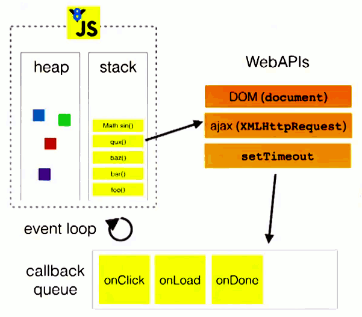

# 事件循环

## 概念

### 进程与线程

进程是 CPU 资源分配的最小单位；线程是 CPU 调度的最小单位。

一个进程由一个或多个线程组成，线程是一个进程中代码的不同执行路线；

一个进程的内存空间是共享的，每个线程都可用这些共享内存。

### 多进程与多线程

**多进程**：在同一个时间里，同一个计算机系统中如果允许两个或两个以上的进程处于运行状态。多进程带来的好处是明显的，比如你可以听歌的同时，打开编辑器敲代码，编辑器和听歌软件的进程之间丝毫不会相互干扰。

**多线程**：程序中包含多个执行流，即在一个程序中可以同时运行多个不同的线程来执行不同的任务，也就是说允许单个程序创建多个并行执行的线程来完成各自的任务。

## 浏览器内核

简单来说浏览器内核是通过取得页面内容、整理信息（应用CSS）、计算和组合最终输出可视化的图像结果，通常也被称为渲染引擎。

浏览器内核是多线程，在内核控制下各线程相互配合以保持同步，一个浏览器通常由以下常驻线程组成：

- GUI 渲染线程
- JavaScript引擎线程
- 定时触发器线程
- 事件触发线程
- 异步http请求线程

### 1.GUI渲染线程

- 主要负责页面的渲染，解析HTML、CSS，构建DOM树，布局和绘制等。
- 当界面需要重绘或者由于某种操作引发回流时，将执行该线程。
- 该线程与JS引擎线程互斥，当执行JS引擎线程时，GUI渲染会被挂起，当任务队列空闲时，主线程才会去执行GUI渲染。

### 2.JS引擎线程

- 该线程当然是主要负责处理 JavaScript脚本，执行代码。
- 也是主要负责执行准备好待执行的事件，即定时器计数结束，或者异步请求成功并正确返回时，将依次进入任务队列，等待 JS引擎线程的执行。
- 当然，该线程与 GUI渲染线程互斥，当 JS引擎线程执行 JavaScript脚本时间过长，将导致页面渲染的阻塞。

### 3.定时器触发线程

- 负责执行异步定时器一类的函数的线程，如： setTimeout，setInterval。
- 主线程依次执行代码时，遇到定时器，会将定时器交给该线程处理，当计数完毕后，事件触发线程会将计数完毕后的事件加入到任务队列的尾部，等待JS引擎线程执行。

### 4.事件触发线程

- 主要负责将准备好的事件交给 JS引擎线程执行。

比如 setTimeout定时器计数结束， ajax等异步请求成功并触发回调函数，或者用户触发点击事件时，该线程会将整装待发的事件依次加入到任务队列的队尾，等待 JS引擎线程的执行。

### 5.异步http请求线程

- 负责执行异步请求一类的函数的线程，如： Promise，axios，ajax等。
- 主线程依次执行代码时，遇到异步请求，会将函数交给该线程处理，当监听到状态码变更，如果有回调函数，事件触发线程会将回调函数加入到任务队列的尾部，等待JS引擎线程执

## 浏览器事件循环

<<<<<<< HEAD
=======
## 宏任务和微任务

### 宏任务 macrotask：

- script(整体代码)，
- 事件回调，
- XHR回调，
- 定时器（setTimeout/setInterval），
- setImmediate（Node.js独有）
- IO操作，
- UI render

### 微任务 microtask：更新应用程序状态的任务

- Promise.then回调，
- MutationObserver，
- queueMicrotask,
- process.nextTick（Node.js独有）

其中 setImmediate 和 process.nextTick 是 Node.js 的实现
>>>>>>> 0541274... 更新: 面试—JavaScript 篇中深入原理下 事件循环


**事件循环（Event Loop）** 是让 JavaScript 做到既是「单线程」，又绝对「不会阻塞」的核心机制，也是 JavaScript 「并发模型（Concurrency Model）」的基础，是用来协调各种事件、用户交互、脚本执行、UI 渲染、网络请求等的一种机制。

> 说的更简单一点：Event Loop 只不过是实现异步的一种机制而已。

### 队列

**队列执行时机**

- 宏任务队列：优先级低于微任务队列，一般也会比 animation 队列优先级低，但不是绝对。
- 微任务队列：会在 JavaScript 调用栈为空的时候立即执行。
- animation 队列：会在页面渲染前执行。
- idle 队列：优先级最低，当浏览器有空闲时间的时候才会执行。

**队列特性**

- 任务队列：每次只执行一个任务，如果有另一个任务加进来，就添加到队列尾部。
- 微任务队列：也是一直执行，直到队列为空，但是，如果处理微任务过程中有新的微任务加进来，加入添加的速度比执行快，那么就会永远执行微任务，事件循环会被阻塞，直到微任务队列完全清空，这就是它会阻止渲染的原因。（微任务的执行会因为 Javascript 堆栈的情况有所不同）
- 动画帧回调队列( rAF(requestAnimationFrame) 回调队列)(动画队列)：会一直执行，直到队列中所有的任务都完成，如果在动画回调内部又有动画回调，它们会在下一帧执行。
- idle 队列(rIC(requestIdleCallback)回调队列)：每次只会执行一个任务。任务完成后会检查是否还有空闲时间，有的话会继续执行下一个任务，没有则等到下次有空闲时间再执行。需要注意的是此队列中的任务也有可能阻塞页面，当空闲时间用完后任务不会主动退出。如果任务占用时间较长，一般会将任务拆分成多个阶段，执行完一个阶段后检查还有没有空闲时间，有则继续，无则注册一个新的 idle 队列任务，然后退出当前任务。

### 任务队列 Task Queue

一个 Event Loop 会有一个或多个 Task Queue，这是一个先进先出（FIFO）的有序列表，存放着来自不同 Task Source（任务源）的 Task。

在 HTML 标准中，定义了几种常见的 Task Source：

1. DOM manipulation（DOM 操作）；
2. User interaction（用户交互）；
3. Networking（网络请求）；
4. History traversal（History API 操作）。

Task Source 的定义非常的宽泛，常见的鼠标、键盘事件，AJAX，数据库操作（例如 IndexedDB），
以及定时器相关的 setTimeout、setInterval 等等都属于 Task Source，所有来自这些 Task Source
的 Task 都会被放到对应的 Task Queue 中等待处理。

对于 Task、Task Queue 和 Task Source，有如下规定：

1. 来自相同 Task Source 的 Task，必须放在同一个 Task Queue 中；
2. 来自不同 Task Source 的 Task，可以放在不同的 Task Queue 中；
3. 同一个 Task Queue 内的 Task 是按到达的先后顺序执行的；
4. 但对于不同的 Task Queue（Task Source），浏览器会进行调度，允许优先执行来自特定 Task Source 的 Task。

> 例如，鼠标、键盘事件和网络请求都有各自的 Task Queue，当两者同时存时，浏览器可以「优先从用户交互」相关的 Task Queue 中挑选 Task 并执行，比如这里的鼠标、键盘事件，从而保证流畅的用户体验。

### 调用栈和任务队列关系图

> 当执行（浏览器将解析此脚本标记并创建任务） script 标签内的代码时（或者执行 `main.js` 入口文件），将会有一个类似 main 的函数，它指代 script 标签内的整体代码（文件自身）。

调用栈是一个栈结构，函数调用会形成一个栈帧，帧中包含了当前执行函数的参数和局部变量等上下文信息，函数执行完后，它的执行上下文会从栈中弹出。

调用栈采用的是后进先出的规则，当函数执行的时候，会被添加到栈的顶部，当函数执行完成后，就会从栈顶移出，直到栈内被清空。

下图就是调用栈和任务队列的关系图：



**JavaScript Runtime 的整个运行流程**

1. 主线程不断循环；
2. 对于「同步任务」，创建执行上下文（[Execution Context](https://tc39.es/ecma262/#sec-execution-contexts)），按顺序进入执行栈（参考 [Calling scripts](https://html.spec.whatwg.org/multipage/webappapis.html#calling-scripts)）；
3. 对于异步任务：
   - 与步骤 2 相同，同步执行这段代码；
   - 将相应的 Task（或 Microtask）添加到 Event Loop 的任务队列；
   - 由其他线程来执行具体的异步操作。
     > 其他线程是指：尽管 JavaScript 是单线程的，但浏览器内核是多线程的，它会将 GUI 渲染、定时器触发、HTTP 请求等工作交给专门的线程来处理。
     > 
     > 另外，在 Node.js 中，异步操作会优先由 OS 或第三方系统提供的异步接口来执行，然后才由线程池处理。
4. 当主线程执行完当前执行栈中的所有任务，就会去读取 Event Loop 的任务队列，取出并执行任务；
5. 重复以上步骤。

### Event Loop 处理模型

1. 执行 Task：从 Task Queue 中取出最老的一个 Task 并执行；如果没有 Task，直接跳过。
2. 执行 Microtasks：遍历 Microtask Queue 并执行所有 Microtask（参考 [Perform a microtask checkpoint](https://html.spec.whatwg.org/multipage/webappapis.html#perform-a-microtask-checkpoint)）。
3. 进入 Update the rendering（更新渲染）阶段：
   1. 设置 Performance API 中 now() 的返回值。[Performance API](https://developer.mozilla.org/en-US/docs/Web/API/Performance) 属于 [W3C High Resolution Time API](https://www.w3.org/TR/hr-time/) 的一部分，用于前端性能测量，能够细粒度的测量首次渲染、首次渲染内容等的各项绘制指标，是前端性能追踪的重要技术手段，感兴趣的同学可关注。
   2. 遍历本次 Event Loop 相关的 Documents，执行更新渲染。在迭代执行过程中，浏览器会根据各种因素判断是否要跳过本次更新。
   3. 当浏览器确认继续本次更新后，处理更新渲染相关工作：
      1. 触发各种事件：Resize、Scroll、Media Queries、CSS Animations、Fullscreen API。
      2. 执行 animation frame callbacks，window.[requestAnimationFrame](https://developer.mozilla.org/en-US/docs/Web/API/window/requestAnimationFrame) 就在这里。
      3. 更新 intersection observations，也就是 [Intersection Observer API](https://developer.mozilla.org/en-US/docs/Web/API/Intersection_Observer_API)（可用于图片懒加载）。更新渲染和 UI，将最终结果提交到界面上。

用一张简图来描述一下：


## Node.js 事件循环

### 与浏览器的不同

- 没有脚本解析事件（不用从 HTML 中挑选 JavaScript，而是直接给它一个 JavaScript 文件并运行它）
- 没有用户交互
- 没有动画帧回调(requestAnimationCallback)
- 没有渲染管道(rendering pipeline)

### 队列

- 宏任务队列

  - timers 定时器阶段（setTimeout, setInterval）
  - 轮询 poll 阶段（事件回调、XHR请求、磁盘读写）
  - check 阶段（setImmediate）

- 微任务队列
  
  - `Promise` 队列，工作原理与浏览器 `Promise` 相同 — 每个任务完成后，将运行 `Promise` 微任务队列。
  - 也是在每个任务完成后，运行 `nextTick` 队列，与 `Promise` 的主要区别是，如果同时拥有 `Promise` 和 `nextTick` 回调， `nextTick` 回调会在  `Promise` 之前执行（`nextTick` 回调优先级高于 `Promise`）。

### 整个 Node.js 的运行原理

从左到右，从上到下，Node.js 被分为了四层，分别是 应用层、V8引擎层、Node API层 和 LIBUV层。


- 应用层： 即 JavaScript 交互层，常见的就是 Node.js 的模块，比如 http，fs
- V8引擎层： 即利用 V8 引擎来解析JavaScript 语法，进而和下层 API 交互
- Node API层： 为上层模块提供系统调用，一般是由 C 语言来实现，和操作系统进行交互 。
- LIBUV层： 是跨平台的底层封装，实现了 事件循环、文件操作等，是 Node.js 实现异步的核心 。

### 什么是事件循环？

事件循环使 `Node.js` 可以通过将操作转移到系统内核中来执行非阻塞 `I/O` 操作（尽管 `JavaScript` 是单线程的）。

### 事件循环机制解析

`Node.js` 启动时，它将初始化事件循环，处理提供的输入脚本（或放入 REPL），这些脚本可能会进行「异步 API」 调用，调度「计时器」或调用 `process.nextTick`， 然后开始处理事件循环。

下面的图表展示了事件循环操作顺序的简化概览。

```
   ┌───────────────────────────┐
┌─>│           timers          │
│  └─────────────┬─────────────┘
│  ┌─────────────┴─────────────┐
│  │     pending callbacks     │
│  └─────────────┬─────────────┘
│  ┌─────────────┴─────────────┐
│  │       idle, prepare       │
│  └─────────────┬─────────────┘      ┌───────────────┐
│  ┌─────────────┴─────────────┐      │   incoming:   │
│  │           poll            │<─────┤  connections, │
│  └─────────────┬─────────────┘      │   data, etc.  │
│  ┌─────────────┴─────────────┐      └───────────────┘
│  │           check           │
│  └─────────────┬─────────────┘
│  ┌─────────────┴─────────────┐
└──┤      close callbacks      │
   └───────────────────────────┘
```

*注意：每个框被称为事件循环机制的一个阶段。*

1. 每个阶段都有一个要执行的回调 FIFO 队列。
2. 当事件循环进入给定阶段时，它将执行该阶段特定的任何操作，然后在该阶段的队列中执行回调，直到队列耗尽或执行回调的最大数量为止，当队列为空或达到回调限制时，事件循环移至下一个阶段。
3. 当所有阶段被顺序执行一次后，称 事件循环完成了一个 tick

### 各阶段概述

- 定时器(timer)：本阶段执行已经被 `setTimeout()` 和 `setInterval()` 的调度回调函数。
- 待定回调(pending callbacks)：执行延迟到下一个循环迭代的 I/O 回调。（上一个循环 poll 阶段还没来得及处理的回调）
- idle, prepare：仅系统内部使用。
- 轮询(poll)： 检索新的 I/O 事件；执行与 I/O 相关的回调（除了关闭回调，那些由计时器和 `setImmediate()` 调度的之外），其余情况 node 将适当的时候在此阻塞。
- 检测(check)：`setImmediate()` 回调在这里执行。
- 关闭的回调函数(close callbacks)：一些关闭的回调函数，例如 `socket.on('close', ...)`

### timers 计时器阶段

计时器可以在回调后面指定时间阈值，但这不是我们希望其执行的确切时间。计时器回调将在经过指定的时间后尽早运行。但是，操作系统调度或其他回调的运行可能会延迟它们。-- `执行的实际时间不确定`

**注意**：从技术上讲，轮询 `poll` 阶段控制计时器的执行时间。

注意：为防止轮询 `poll` 阶段使事件循环陷入饥饿状态 (一直等待 `poll` 事件)，libuv 还具有一个硬最大值限制来停止轮询。

### pending callbacks 阶段

此阶段执行某些系统操作的回调，例如 TCP 错误。 举个例子，如果 TCP 套接字在尝试连接时收到 ECONNREFUSED，则某些 * nix 系统希望等待报告错误。 这将会在 `pending callbacks` 阶段排队执行。

### 轮询 poll 阶段

轮询阶段具有两个主要功能：

 - 计算应该阻塞并轮询  I/O 的时间
 - 处理轮询队列 (poll queue) 中的事件


当事件循环进入轮询 `poll` 阶段并且没有任何计时器调度 (timers scheduled) 时，将发生以下两种情况之一：

  - 如果轮询队列 (poll queue) 不为空，则事件循环将遍历其回调队列，使其同步执行，
  直到队列用尽或达到与系统相关的硬限制为止。
  - 如果轮询队列为空，则会发生以下两种情况之一：
      
      - 如果已通过 `setImmediate` 调度了脚本，则事件循环将结束轮询 `poll` 阶段，并继续执行检查 `check` 阶段以执行那些调度的脚本。
      - 如果脚本并没有 `setImmediate` 设置回调，则事件循环将等待 `poll` 队列中的回调，然后立即执行它们。

一旦轮询队列 (poll queue) 为空，事件循环将检查哪些计时器 `timer` 已经到时间。如果一个或多个计时器 `timer` 准备就绪，则事件循环将返回到计时器阶段，以执行这些计时器的回调。

### 检查阶段 check

此阶段允许在轮询 `poll` 阶段完成后立即执行回调。 如果轮询 `poll` 阶段处于空闲，并且脚本已使用 `setImmediate` 进入 `check` 队列，则事件循环可能会进入 `check` 阶段，而不是在 `poll` 阶段等待。

### close callbacks 阶段

如果套接字或句柄突然关闭（例如 `socket.destroy`），则在此阶段将发出 'close' 事件。否则它将通过 `process.nextTick` 发出。

### setImmediate vs setTimeout

`setImmediate` 和 `setTimeout` 相似，但是根据调用时间的不同，它们的行为也不同。

 - `setImmediate` 设计为在当前轮询 `poll` 阶段完成后执行脚本。
 - `setTimeout` 计划在以毫秒为单位的最小阈值过去之后运行脚本。

计时器的执行顺序将根据调用它们的上下文而有所不同。 如果两者都是主模块 (main module) 中调用的，则时序将受到进程性能的限制（这可能会受到计算机上运行的其他应用程序的影响）。

- 如果我们运行以下不在 I/O 回调（即主模块）内的脚本，则两个计时器的执行顺序是不确定的，因为它受进程性能的约束
- 如果这两个调用在一个 I/O 回调中，那么 `immediate` 总是执行第一

Q：那为什么在外部 (比如主代码部分 mainline) 这两者的执行顺序不确定呢？

A：在 mainline 部分执行 `setTimeout` 设置定时器 (没有写入队列呦)，与 `setImmediate` 写入 `check` 队列。mainline 执行完开始事件循环，第一阶段是 `timers`，这时候 `timers` 队列可能为空，也可能有回调；如果没有那么执行 `check` 队列的回调，下一轮循环在检查并执行 `timers` 队列的回调；如果有就先执行`timers` 的回调，再执行 `check` 阶段的回调。因此这是 `timers` 的不确定性导致的。

### process.nextTick

**理解 process.nextTick**：

你可能已经注意到 `process.nextTick` 并未显示在图中，即使它是「异步 API」 的一部分也是如此。这是因为 `process.nextTick` 从技术上讲不是事件循环的一部分。相反，无论事件循环的当前阶段如何，都将在当前操作完成之后处理 `nextTickQueue`。 在此，将操作定义为在 C/C ++ 处理程序基础下过渡并处理需要执行的 JavaScript。

在给定阶段里可以在任意时间调用 `process.nextTick`，传递给 `process.nextTick` 的所有回调都将在事件循环继续之前得到解决。这可能会导致一些不良情况，因为它允许您通过进行递归 `process.nextTick` 调用来让 I/O 处于 "饥饿" 状态，从而防止事件循环进入轮询 `poll` 阶段。

**process.nextTick() vs setImmediate()**：

它们的调用方式很相似，但是名称让人困惑。

- `process.nextTick` 在同一阶段立即触发
- `setImmediate` fires on the following iteration or 'tick' of the event loop (在事件循环接下来的阶段迭代中执行 - `check` 阶段)。

本质上，名称应互换。 `process.nextTick` 比 `setImmediate` 触发得更快，但由于历史原因，不太可能改变。 进行此切换将破坏 npm 上很大一部分软件包。 每天都会添加更多的新模块，这意味着我们每天都在等待，更多潜在的损坏发生。 尽管它们令人困惑，但名称本身不会改变。

建议开发人员在所有情况下都使用 `setImmediate`，因为这样更容易推理（并且代码与各种环境兼容，例如浏览器 JS。）- 但是如果理解底层原理，就不一样。

**为什么还用 process.nextTick？**

- 在事件循环继续之前下个阶段允许开发者处理错误，清理所有不必要的资源，或者重新尝试请求。
- 有时需要让回调在事件循环继续下个阶段之前运行 (At times it's necessary to allow a callback to run after the call stack has unwound but before the event loop continues.)。

** process.nextTick 在事件循环的位置**：

```
           ┌───────────────────────────┐
        ┌─>│           timers          │
        │  └─────────────┬─────────────┘
        │           nextTickQueue
        │  ┌─────────────┴─────────────┐
        │  │     pending callbacks     │
        │  └─────────────┬─────────────┘
        │           nextTickQueue
        │  ┌─────────────┴─────────────┐
        |  |     idle, prepare         │
        |  └─────────────┬─────────────┘
  nextTickQueue     nextTickQueue
        |  ┌─────────────┴─────────────┐
        |  │           poll            │
        │  └─────────────┬─────────────┘
        │           nextTickQueue
        │  ┌─────────────┴─────────────┐
        │  │           check           │
        │  └─────────────┬─────────────┘
        │           nextTickQueue
        │  ┌─────────────┴─────────────┐
        └──┤       close callbacks     │
           └───────────────────────────┘
```

下图补充了官方并没有提及的 `Microtasks` 微任务:


### Microtasks 微任务

> 微任务会在主线之后和事件循环的每个阶段之后立即执行。

如果您熟悉 JavaScript 事件循环，那么应该对微任务不陌生，这些微任务在 Node 中的工作方式相同。

在 Node 领域，微任务是来自以下对象的回调：

- `process.nextTick()`
- `then()` handlers for resolved or rejected Promises

在主线结束后以及事件循环的每个阶段之后，立即运行微任务回调。（高版本 Node.js 与浏览器行为一致）

resolved 的 `promise.then` 回调像微处理一样执行，就像 `process.nextTick` 一样。 虽然，如果两者都在同一个微任务队列中，则将首先执行 `process.nextTick` 的回调。

优先级 `process.nextTick` > `promise.then` = `queueMicrotask`

### 总结

1. Node.js 的事件循环分为 6 个阶段
2. 浏览器和 Node 环境下，microtask 任务队列的执行时机不同  
  2.1 Node.js 中，microtask 在事件循环的各个阶段之间执行（高版本 Node.js 与浏览器行为一致，在每个 macrotask 执行完之后执行）  
  2.2 浏览器端，microtask 在事件循环的每个 macrotask 执行完之后执行
3. 递归的调用 `process.nextTick()` 会导致I/O starving，官方推荐使用 `setImmediate()`

## Node 的事件循环机制（来自 [Node.js事件循环EventLoop机制 异步原理](https://www.youtube.com/watch?v=5uCopOqHIok&t=166s)）

libuv 是一个高性能的，事件驱动的I/O库

这个库负责各种回调函数的执行顺序，毕竟异步任务最后还是要回到主线程，排队等待执行，这就是事件循环。

1、定时器

Node 提供了四个定时器，让任务可以在指定的时间运行：setTimeout、setInterval、setImmediate、process.nextTick。前两个是语言的标准，后两个是 Node 独有的。

```javascript
setTimeout(() => console.log(1));
setImmediate(() => console.log(2));
process.nextTick(() => console.log(3));
Promise.resolve().then(() => console.log(4));
(() => console.log(5));
// 5 3 4 1 2
```

2、同步任务和异步任务

同步任务总是比异步任务更早执行

3、本轮循环和次轮循环

异步任务可以分为两种：追加在本轮循环的异步任务、追加在次轮循环的异步任务。所谓“循环”，值得是事件循环（event loop）。这是 JavaScript 引擎处理异步任务的方式，本轮循环一定早于次轮循环执行。

Node 规定，process.nextTick 和 Promise 的回调函数，追加在本轮循环，即同步任务一旦执行完成，就开始执行它们，且 process.nextTick 是所有异步任务里面最快执行的。

而 setTimeout、setInterval、setImmediate 的回调函数，追加在次轮循环。

4、微任务

根据语言规定，Promise 对象的回调函数，会进入异步任务里面的“微任务”(microtask)队列。微任务队列追加在 `process.nextTick` 队列的后面，也属于本轮循环。所以上面的代码总是先输出 3，再输出 4。

至此，本轮循环的执行顺序：同步任务 => `process.nextTick()` => 微任务

5、事件循环执行顺序

Node 只有一个主线程，事件循环是在主线程上完成的。开始执行脚本时，会先进行事件循环的初始化，但是这时事件循环还没有开始，会先完成下面的事情：同步任务、发出异步任务、规划定时器生效时间、执行 `process.nextTick` 等等。最后上面事情都干完了，事件循环就正式开始了。事件循环会无限次地执行，一轮又一轮。只有异步任务的回调函数队列清空了，才会停止执行。每一轮的事件循环，分成六个阶段，这些阶段会依次执行：

  1. timers: 该阶段执行定时器的回调，如 setTimeout 和 setInterval
  2. I/O callbacks: 该阶段执行除了 close 事件，定时器和 setImmediate 的回调外的所有回调
  3. idle, prepare: 内部使用
  4. poll: 等待新的 I/O 事件，node 在一些特殊的情况下会阻塞在这里，比如服务器的响应、用户移动鼠标等等
  5. check: setImmediate 的回调会在这个阶段执行
  6. close callbacks: 例如 socket.on('close', ...) 这种 close 事件的回调

6、事件循环示例一

```javascript
const fs = require('fs')

const timeoutScheduled = Date.now()

// 异步任务一：100ms 后执行的定时器
setTimeout(() => {
  console.log('timer: ')
  const delay = Date.now() - timeoutScheduled
  console.log(`${delay}ms`)
}, 100)

// 异步任务二：文件读取后，有一个 200 ms 的回调函数
fs.readFile('test.js', (err, content) => {
  const startCallback = Date.now()
  while(Date.now() - startCallback < 200) {
    // nothing
  }
})

// 结果：取决于 读取文件所花费的时间是否大于 100ms
//  小于 100ms：先执行异步任务二再执行异步任务一
//  大于 100ms：先执行异步任务一再执行异步任务二
```

7、事件循环示例二

```javascript
setTimeout(() => console.log(1))
setImmediate(() => console.log(2))
// 输出 2 1
```

```javascript
const fs = require('fs')

fs.readFile('test.js', () => {
  setTimeout(() => console.log(1))
  setImmediate(() => console.log(2))
})
// 输出 2 1
```

## 参考

- :star: [深入理解 JavaScript Event Loop](https://zhuanlan.zhihu.com/p/34229323)
- :star: [再谈谈 Promise, setTimeout, rAF, rIC](https://segmentfault.com/a/1190000019154514)
- [浏览器与Node的事件循环(Event Loop)有何区别?—浪里行舟](https://juejin.cn/post/6844903761949753352)
- [深入理解js事件循环机制（浏览器篇）](http://lynnelv.github.io/js-event-loop-browser)
- [Node.js 事件循环-比官方更全面—官方文档翻译](https://learnku.com/articles/38802)
- [Node.js 事件循环，定时器和 process.nextTick()—官方文档](https://nodejs.org/zh-cn/docs/guides/event-loop-timers-and-nexttick/)
- [当事件循环遇到更新渲染—大转转FE](https://zhuanlan.zhihu.com/p/267273074)
- [Node.js事件循环EventLoop机制 异步原理](https://www.youtube.com/watch?v=5uCopOqHIok&t=166s)