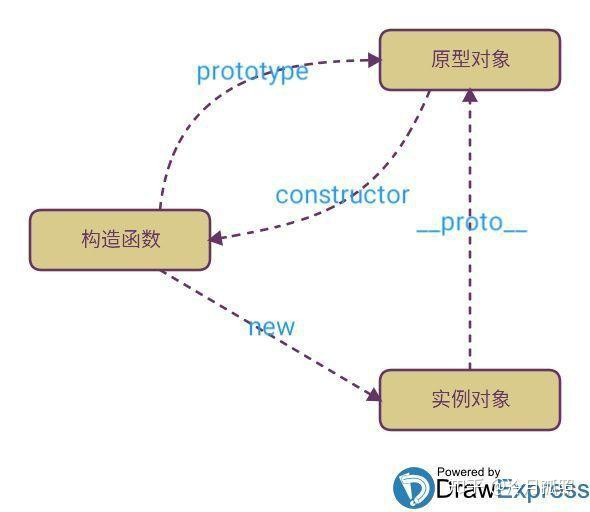
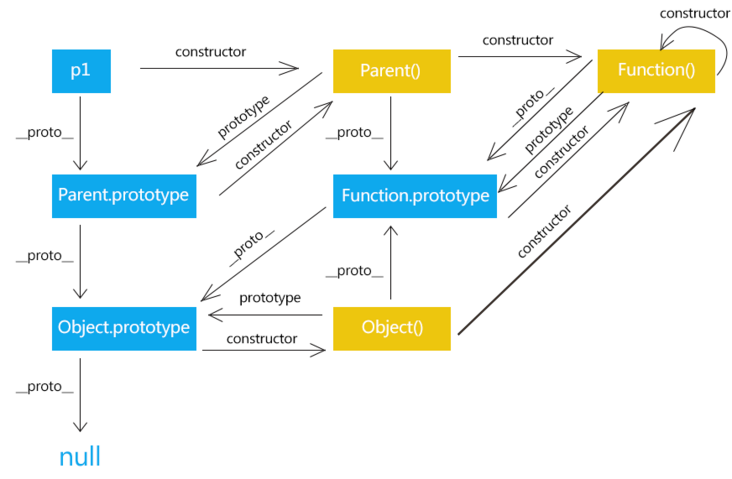

## 原型原型链

### 原型

> 概念：在构造函数创建的时候，系统默认的帮构造函数创建并关联一个对象 这个对象就是原型

> 作用：在原型中的所有属性和方法，都可以被和其关联的构造函数创建出来的所有的对象共享

JavaScript 的每个对象都继承自另一个对象，后者称为“原型”（prototype）对象。只有 `null` 除外，它没有自己的原型对象。

使用原型的好处是：原型对象上的所有属性和方法，都能被对应的构造函数创建的实例对象共享（这就是 JavaScript 继承机制的基本设计），也就是说，不必在构造函数中定义对象实例的(公共)信息，而是可以将这些信息直接添加到原型对象中。

每一个构造函数都有一个 `prototype`（原型）属性，这个属性就是使用构造函数创建出来的实例对象的原型对象。

每一个实例对象都有一个 `__proto__` (隐式原型) 属性，这个属性指向创建它出来的构造函数的原型对象(`prototype`)。

原型对象也有一个自己的原型对象(`__proto__`)，层层向上直到 `Object.prototype` 对象的原型对象(`__proto__`)为 `null`。`null` 没有原型，并作为这个原型链中的最后一个环节。



### 原型链

#### 什么是原型链？

> 对象的属性和方法，可能定义在自身，也可能是定义在它的原型上，由于原型本身也是对象，又有自己的原型，所以形成了一条原型链。

如果一层层地上溯，所有对象的原型最终都可以上溯到 `Object.prototype`，即 `Object` 构造函数的 `prototype` 属性指向的那个对象。而 `Object.prototype` 对象的原型就是没有任何属性和方法的 `null` 对象，而 `null` 对象没有自己的原型。

#### 原型链的作用？

在读取对象的某个属性时，JavaScript 引擎将首先检查对象本身是否存在该属性。 如果不存在，就会到它的原型上去找。如果找不到，就到原型的原型上进行查找；如果直到最顶层的 `Object.prototype` 还是找不到，则返回 `undefined`。

如果对象自身和它的原型，都定义了一个同名属性，那么优先读取对象自身的属性，这叫做“覆盖”（overriding）。

**注意**: 需要注意的是，一级级向上，在原型链寻找某个属性，对性能是有影响的。所寻找的属性在越上层的原型对象，对性能的影响越大。如果寻找某个不存在的属性，将会遍历整个原型链。

### 对象之间的关系

1. `Object.__proto__ === Function.prototype`。`Object` 本质上是一个built-in 的全局构造函数，也是 `Function` 构造函数的实例。所以 `Object.__proto__ === Function.prototype`。  
2. `Number`，`Date`，`Array` 等 built-in 构造函数都和 `Object` 构造函数一样。 
3. `Function.prototype` 本质也是对象，所以其 `__proto__` 指向 `Object.prototype`。   
4. `Function` 本质也是构造函数，但它是自身的实例，因此其 `__proto__` 指向 `Function.prototype`。



### Class 

>  ES6 的class 可以看作是一个语法糖，它的绝大部分功能，ES5 都可以做到，新的class 写法只是让对象原型的写法更加清晰、更像面向对象编程的语法而已。

```javascript
// ES5
function Point(x, y) {
  this.x = x;
  this.y = y;
}

Point.prototype.toString = function () {
  return '(' + this.x + ', ' + this.y + ')';
};

var p = new Point(1, 2);
// ES6

//定义类
class Point {
  constructor(x, y) {
    this.x = x;
    this.y = y;
  }

  toString() {
    return '(' + this.x + ', ' + this.y + ')';
  }
}
```

**特点**

- `class` 中的 `constructor` 函数相当于ES5中的构造函数。
- 类的内部定义的所有方法都是不可枚举的。
- 类和模块内部默认采用严格模式。
- 子类继承父类以后，必须在 `constructor` 中调用时 `super` 方法，否则不能新建实例，因为子类没有属于自己的 `this` 对象，而是继承了父类的 `this` 对象对其进行加工。

类和原型的关系：

>  每一个对象都有 `__proto__` 属性，指向对应的构造函数的 `prototype` 属性。`class` 作为构造函数的语法糖，同时有 `prototype` 属性和 `__proto__` 属性，因此同时存在两条继承链。

1. 子类的 `__proto__` 属性，表示构造函数的继承，总是指向父类。  
2. 子类 `prototype` 属性的 `__proto__` 属性，表示实例方法的继承，总是指向父类的 `prototype` 属性。

```javascript
class A {
}

class B extends A {
}

B.__proto__ === A // true
B.prototype.__proto__ === A.prototype // true
```

作为一个对象，子类（B）的原型（`__proto__`属性）是父类（A）；

作为一个构造函数，子类（B）的原型对象（ `prototype` 属性）是父类的原型对象（ `prototype` 属性）的实例。

#### **实例的 `__proto__` 属性**

>  子类实例的 `__proto__` 属性的 `__proto__` 属性，指向父类实例的`__proto__` 属性。也就是说，子类的原型的原型，是父类的原型。

```javascript
var p1 = new Point(2, 3);
var p2 = new ColorPoint(2, 3, 'red');

p2.__proto__ === p1.__proto__ // false
p2.__proto__.__proto__ === p1.__proto__ // true
```

#### **类中 `this` 指向问题**

>  类的方法内部含有 `this`，默认指向类的实例。但是当类中的实例方法提取出来使用的时候，`this` 指向运行时所在环境。

解决办法：

```javascript
class Logger {
  constructor() {
    this.printName = this.printName.bind(this);
  }

  // ...
}

class Logger {
  constructor() {
    this.printName = (name = 'there') => {
      this.print(`Hello ${name}`);
    };
  }

  // ...
}
```

#### **ES5与ES6 实现继承的区别**

- 在ES5中，继承实质上是子类先创建属于自己的 `this`，然后再将父类的方法添加到 `this`（也就是使用 `Parent.apply(this)`的方式

- 而在ES6中，则是先创建父类的实例对象 `this`，然后再用子类的构造函数修改 `this`。

### 参考

- [JavaScript 原型，原型链 ? 有什么特点？— 牛客网](https://www.nowcoder.com/questionTerminal/dafdf862d4614009a9eab014a157dd83)
- [JavaScript 原型和原型链 — 冷月孤照](https://zhuanlan.zhihu.com/p/39549472)
- [JavaScript原型&原型链 — 巴斯光年](https://segmentfault.com/a/1190000021232132)
- [深入理解Javascript原型关系](https://segmentfault.com/a/1190000013022549)
- [详解js原型，构造函数以及class之间的原型关系](https://cloud.tencent.com/developer/article/1408666)
