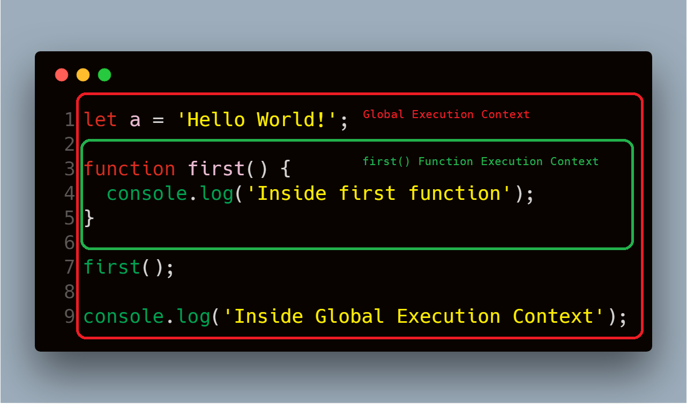

# 闭包

## 目录

  - [什么是闭包？](#什么是闭包)
  - [词法作用域是什么？](#词法作用域是什么)
  - [闭包是如何工作的？](#闭包是如何工作的)
    - [示例1＃](#示例1)
    - [示例 2](#示例-2)
  - [闭包是如何工作的？](#闭包是如何工作的-1)
    - [执行上下文](#执行上下文)
    - [词法环境](#词法环境)
  - [详细的闭包示例](#详细的闭包示例)
    - [示例1＃](#示例1-1)
    - [例子2＃](#例子2)
  - [总结](#总结)
  - [参考](#参考)

## 什么是闭包？

> 闭包是即使外部函数返回之后也可以访问其外部函数作用域的函数。这意味着闭包即使外层函数执行完成了也可以记住并访问外层函数的变量和参数。

在深入探讨闭包之前，让我们首先了解词法作用域。

## 词法作用域是什么？

JavaScript 中的「词法作用域」或「静态作用域」是指变量、函数和对象根据其在源代码中的实际位置而产生的「可访问性」。

```javascript
let a = 'global';
  function outer() {
    let b = 'outer';
    function inner() {
      let c = 'inner'
      console.log(c);   // prints 'inner'
      console.log(b);   // prints 'outer'
      console.log(a);   // prints 'global'
    }
    console.log(a);     // prints 'global'
    console.log(b);     // prints 'outer'
    inner();
  }
outer();
console.log(a);         // prints 'global'
```

在此，`inner` 函数可以访问在其自己的作用域，`outer` 函数的作用域和全局作用域中定义的变量。并且 `outer` 函数可以访问在其自身作用域和全局作用域中定义的变量。

因此，上述代码的作用域链如下所示：

```
Global {
  outer {
    inner
  }
}
```

注意，`inner` 函数被 `outer` 函数的词法作用域所包围，而 `outer` 函数的词法作用域又被全局作用域所围绕。这就是 `inner` 函数可以访问 `outer` 函数和全局作用域中定义的变量的原因。

## 闭包是如何工作的？

在深入探讨闭包的工作原理之前，让我们看一下闭包的一些实际示例。

### 示例1＃

```javascript
function person() {
  let name = 'Peter';
  
  return function displayName() {
    console.log(name);
  };
}
let peter = person();
peter(); // prints 'Peter'
```

在此代码中，我们正在调用 `person` 函数，该函数返回内部函数 `displayName` 并将该内部函数存储在 `peter` 变量中。当我们调用 `peter` 函数（实际上引用了`displayName` 函数）时，将在控制台上打印名称“ Peter”。

但是在 `displayName` 函数中我们没有任何名为 `name` 的变量，因此即使该函数返回后，该函数也可以以某种方式访问​​其外部函数变量。所以 `displayName` 函数实际上是一个闭包。

### 示例 2#

```javascript
function getCounter() {
  let counter = 0;
  return function() {
    return counter++;
  }
}
let count = getCounter();
console.log(count());  // 0
console.log(count());  // 1
console.log(count());  // 2
```

再次，我们将由 `getCounter` 函数返回的匿名内部函数存储到 `count` 变量中。由于 `count` 函数现在是一个闭包，因此即使在 `getCounter()` 返回之后，它也可以访问 `getCounter` 函数的 `counter` 变量。

但是请注意，每次 `count` 函数调用时，`counter` 的值都没有像通常那样重置为 0。

这是因为，在每次调用 `count` 时，都会为该函数创建一个新作用域，但是仅为 `getCounter` 函数创建了一个作用域，因为在 `getCounter()` 的作用域中定义了 `counter` 变量，因此它将在每个 `count` 函数调用，而不是重置为0。

## 闭包是如何工作的？

到目前为止，我们已经讨论了什么是闭包及其实际示例。现在，让我们了解闭包在JavaScript中的真正作用。

要真正了解闭包在JavaScript中是如何工作的，我们必须了解JavaScript中两个最重要的概念，即1）执行上下文和2）词法环境。

###  执行上下文

执行上下文是抽象环境，在其中评估和执行JavaScript代码。当执行全局代码时，它在全局执行上下文中执行，而函数代码在函数执行上下文中执行。

当前只能运行一个执行上下文（因为JavaScript是单线程语言），该上下文由称为执行堆栈或调用堆栈的堆栈数据结构管理。

执行堆栈是具有LIFO（后进先出）结构的堆栈，其中只能从堆栈顶部添加或删除项目。

当前正在运行的执行上下文将始终位于堆栈的顶部，并且当前正在运行的函数完成时，将从堆栈中弹出其执行上下文，并且控件将到达堆栈中位于其下方的执行上下文。

让我们看一下代码片段，以更好地了解执行上下文和堆栈：



执行此代码后，JavaScript引擎将创建一个全局执行上下文以执行该全局代码，并且当它遇到对 `first()` 函数的调用时，它将为该函数创建一个新的执行上下文并将其推入执行堆栈的顶部。

因此，上述代码的执行堆栈如下所示：


当 `first()` 函数完成时，其执行堆栈将从堆栈中删除，并且控件到达其下方的执行上下文，即全局执行上下文。因此，将执行全局范围内的其余代码。

### 词法环境

每当JavaScript引擎创建执行上下文以执行该函数或全局代码时，它还会创建一个新的词法环境来存储在该函数执行期间在该函数中定义的变量。

词法环境是保存**标识符变量映射**的数据结构。 （这里的**标识符**是指变量/函数的名称，而**变量**是对实际对象[包括函数类型对象]或原始值的引用）。

词法环境包含两个部分：（1）**环境记录**和（2）**对外部环境的引用**。

1. 环境记录是存储变量和函数声明的实际位置。
2. 对外部环境的引用意味着它可以访问其外部（父）词法环境。为了了解闭包是如何工作的，此组件是最重要的。

词法环境在概念上看起来像这样：

```javascript
lexicalEnvironment = {
  environmentRecord: {
    <identifier> : <value>,
    <identifier> : <value>
  }
  outer: < Reference to the parent lexical environment>
}
```

因此，让我们再次看一下上面的代码片段：

```javascript
let a = 'Hello World!';
function first() {
  let b = 25;  
  console.log('Inside first function');
}
first();
console.log('Inside global execution context');
```

当JavaScript引擎创建用于执行全局代码的全局执行上下文时，它还会创建一个新的词法环境来存储在全局范围内定义的变量和函数。因此，全局范围的词法环境将如下所示：

```javascript
globalLexicalEnvironment = {
  environmentRecord: {
      a     : 'Hello World!',
      first : < reference to function object >
  }
  outer: null
}
```

此处，外部词法环境被设置为null，因为对于全局范围没有外部词法环境。

当引擎为 `first()` 函数创建执行上下文时，它还会创建一个词法环境来存储在函数执行期间在该函数中定义的变量。因此，该函数的词法环境如下所示：

```javascript
functionLexicalEnvironment = {
  environmentRecord: {
      b    : 25,
  }
  outer: <globalLexicalEnvironment>
}
```

函数的外部词法环境被设置为全局词法环境，因为函数在源代码中被全局作用域所包围。

:star: **注意**—函数完成后，其执行上下文将从堆栈中删除，但它的词法环境可能会或可能不会从内存中删除，这取决于该词法环境是否被其外部词法环境属性中的任何其他词法环境引用。

## 详细的闭包示例

现在，我们了解了执行上下文和词法环境，让我们回到闭包。

### 示例1＃

看一下以下代码片段：

```javascript
function person() {
  let name = 'Peter';
  
  return function displayName() {
    console.log(name);
  };
}
let peter = person();
peter(); // prints 'Peter'
```

当执行 `person` 函数时，JavaScript引擎将为该函数创建一个新的执行上下文和词法环境。此函数完成后，它将返回 `displayName` 函数并将其分配给 `peter` 变量。

因此其词法环境将如下所示：

```javascript
personLexicalEnvironment = {
  environmentRecord: {
    name : 'Peter',
    displayName: < displayName function reference>
  }
  outer: <globalLexicalEnvironment>
}
```

当 `person` 函数完成时，其执行上下文将从堆栈中删除。但是它的词法环境仍在内存中，因为它的词法环境由其内部 `displayName` 函数的词法环境引用。因此，其变量仍在内存中可用。

请注意，创建 `personLexicalEnvironment` 时，JavaScript引擎会将 `personLexicalEnvironment` 附加到该词法环境内的所有函数定义中。这样，以后如果调用任何内部函数，JavaScript引擎便可以将外部词法环境设置为附加到该函数定义的词法环境。

当执行 `peter` 函数（实际上是对 `displayName` 函数的引用）时，JavaScript引擎将为该函数创建一个新的执行上下文和词法环境。

因此其词法环境如下所示：

```javascript
displayNameLexicalEnvironment = {
  environmentRecord: {
    
  }
  outer: <personLexicalEnvironment>
}
```

由于 `displayName` 函数中没有变量，因此其环境记录将为空。在执行此函数期间，JavaScript引擎将尝试在函数的词法环境中查找变量名称。

由于 `displayName` 函数的词法环境中没有变量，因此它将查看外部词法环境，即仍存在于内存中的 `person` 函数的词法环境。 JavaScript引擎找到该变量，并将名称打印到控制台。

### 例子2＃

```javascript
function getCounter() {
  let counter = 0;
  return function() {
    return counter++;
  }
}
let count = getCounter();
console.log(count());  // 0
console.log(count());  // 1
console.log(count());  // 2
```

同样，`getCounter` 函数的词法环境将如下所示：

```javascript
getCounterLexicalEnvironment = {
  environmentRecord: {
    counter: 0,
    <anonymous function> : < reference to function>
  }
  outer: <globalLexicalEnvironment>
}
```


该函数返回一个匿名函数，并将其分配给 `count` 变量。

当执行 `count` 函数时，其词法环境将如下所示：

```javascript
countLexicalEnvironment = {
  environmentRecord: {
  
  }
  outer: <getCountLexicalEnvironment>
}
```

调用 `count` 函数时，JavaScript引擎将针对 `counter` 变量查看此函数的词法环境。同样，由于其环境记录为空，因此引擎将调查该函数的外部词法环境。

引擎找到该变量，将其打印到控制台，并将在 `getCounter` 函数词法环境中增加 `counter` 变量。

因此，第一个调用 `count` 函数之后的 `getCounter` 函数的词法环境将如下所示：

```javascript
getCounterLexicalEnvironment = {
  environmentRecord: {
    counter: 1,
    <anonymous function> : < reference to function>
  }
  outer: <globalLexicalEnvironment>
}
```

在每次调用 `count` 函数时，JavaScript引擎都会为 `count` 函数创建一个新的词法环境，递增 `counter` 变量，并更新 `getCounter` 函数的词法环境以反映更改。

## 总结

因此，我们了解了什么是闭包以及它们如何真正起作用。闭包是每个JavaScript开发人员都应理解的JavaScript基本概念。对这些概念有充分的了解将帮助您成为一个更有效，更好的JavaScript开发人员。


## 参考

- [Understanding Closures in JavaScript](https://blog.bitsrc.io/a-beginners-guide-to-closures-in-javascript-97d372284dda)
