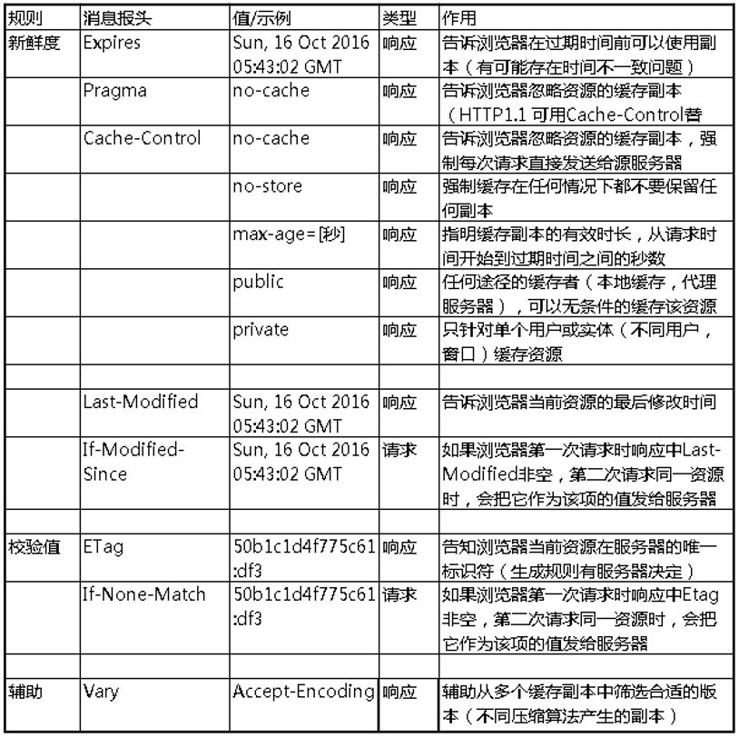
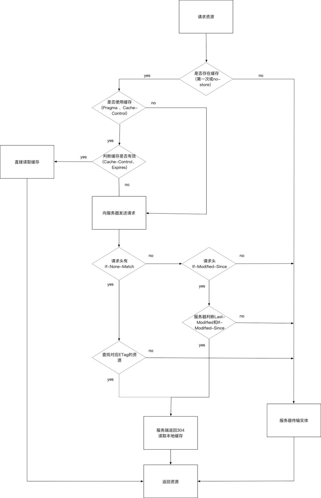

## 浏览器缓存

### 概述

浏览器缓存是浏览器保存通过 HTTP 获取的所有资源,是浏览器将网络资源存储在本地的一种行为。浏览器的缓存机制是根据 HTTP 报文的缓存标识进行的。

### HTTP 的缓存机制

#### 根据什么规则缓存

1. 新鲜度（过期机制）：也就是缓存副本有效期。一个缓存副本必须满足以下条件，浏览器会认为它是有效的，足够新的：
   - 含有完整的过期时间控制头信息（HTTP 协议报头），并且仍在有效期内；
   - 浏览器已经使用过这个缓存副本，并且在一个会话中已经检查过新鲜度；
2. 校验值（验证机制）：服务器返回资源的时候有时在控制头信息带上这个资源的实体标签 Etag（Entity Tag），它可以用来作为浏览器再次请求过程的校验标识。如果发现校验标识不匹配，说明资源已经被修改或过期，浏览器需求重新获取资源内容。

#### HTTP 缓存的两个阶段

浏览器缓存一般分为两类：强缓存（也称本地缓存）和协商缓存（也称弱缓存）。

##### 本地缓存阶段

浏览器发送请求前，会先去缓存里查看是否命中强缓存，如果命中，则直接从缓存中读取资源，不会发送请求到服务器。否则，进入下一步。

##### 协商缓存

当强缓存没有命中时，浏览器一定会向服务器发起请求。服务器会根据 Request Header 中的一些字段来判断是否命中协商缓存。如果命中，服务器会返回 304 响应，但是不会携带任何响应实体，只是告诉浏览器可以直接从浏览器缓存中获取这个资源。如果本地缓存和协商缓存都没有命中，则从直接从服务器加载资源。

##### 启用&关闭缓存

在 HTTP 请求和响应的消息报头中，常见的与缓存有关的消息报头有：

上图中只是常用的消息报头，下面来看下不同字段之间的关系和区别：

**Cache-Control 与 Expires**

- Cache-Control：HTTP1.1 提出的特性，为了弥补 Expires 缺陷加入的，提供了更精确细致的缓存功能。详细了解详细看几个常见的指令：

  - max-age：功能和 Expires 类似，但是后面跟一个以“秒”为单位的相对时间，来供浏览器计算过期时间。
  - no-cache：提供了过期验证机制。
  - no-store：表示当前请求资源禁用缓存；
  - public：表示缓存的版本可以被代理服务器或者其他中间服务器识别；
  - private：表示只有用户自己的浏览器能够进行缓存，公共的代理服务器不允许缓存。

- Expires：HTTP1.0 的特性，标识该资源过期的时间点，它是一个绝对值，格林威治时间（Greenwich Mean Time, GMT），即在这个时间点之后，缓存的资源过期；优先级：Cache-Control 优先级高于 Expires，为了兼容，通常两个头部同时设置；浏览器默认行为：其实就算 Response Header 中沒有设置 Cache-Control 和 Expires，浏览器仍然会缓存某些资源，这是浏览器的默认行为，是为了提升性能进行的优化，每个浏览器的行为可能不一致，有些浏览器甚至没有这样的优化。

**Last-Modified 与 ETag**

- Last-Modified(Response Header)与 If-Modified-Since(Request Header)是一对报文头，属于 http 1.0。

  If-Modified-Since 是一个请求首部字段，并且只能用在 GET 或者 HEAD 请求中。Last-Modified 是一个响应首部字段，包含服务器认定的资源作出修改的日期及时间。当带着 If-Modified-Since 头访问服务器请求资源时，服务器会检查 Last-Modified，如果 Last-Modified 的时间早于或等于 If-Modified-Since 则会返回一个不带主体的 304 响应，否则将重新返回资源。

- ETag 与 If-None-Match 是一对报文头，属于 http 1.1。

  ETag 是一个响应首部字段，它是根据实体内容生成的一段 hash 字符串，标识资源的状态，由服务端产生。If-None-Match 是一个条件式的请求首部。如果请求资源时在请求首部加上这个字段，值为之前服务器端返回的资源上的 ETag，则当且仅当服务器上没有任何资源的 ETag 属性值与这个首部中列出的时候，服务器才会返回带有所请求资源实体的 200 响应，否则服务器会返回不带实体的 304 响应。

**ETag 能解决什么问题？**

a. Last-Modified 标注的最后修改只能精确到秒级，如果某些文件在 1 秒钟以内，被修改多次的话，它将不能准确标注文件的新鲜度；
b. 某些文件也许会周期性的更改，但是他的内容并不改变(仅仅改变的修改时间)，但 Last-Modified 却改变了，导致文件没法使用缓存；
c. 有可能存在服务器没有准确获取文件修改时间，或者与代理服务器时间不一致等情形。

**优先级：ETag 优先级比 Last-Modified 高，同时存在时会以 ETag 为准。**

##### 缓存位置

浏览器可以在内存、硬盘中开辟一个空间用于保存请求资源副本。我们经常调试时在 DevTools Network 里看到 Memory Cache（內存缓存）和 Disk Cache（硬盘缓存），指的就是缓存所在的位置。请求一个资源时，会按照优先级（**Service Worker -> Memory Cache -> Disk Cache -> Push Cache**）依次查找缓存，如果命中则使用缓存，否则发起请求。

##### 整体流程

### 参考

- [彻底弄懂浏览器缓存策略](https://www.jiqizhixin.com/articles/2020-07-24-12)
- [一文读懂前端缓存](https://juejin.cn/post/6844903747357769742?utm_source=gold_browser_extension)
- [能不能说一说浏览器缓存?](https://www.biecuoliao.com/pa/MmLrpQ4.html)
- [浏览器的缓存机制](https://www.cnblogs.com/suihang/p/12855345.html)
