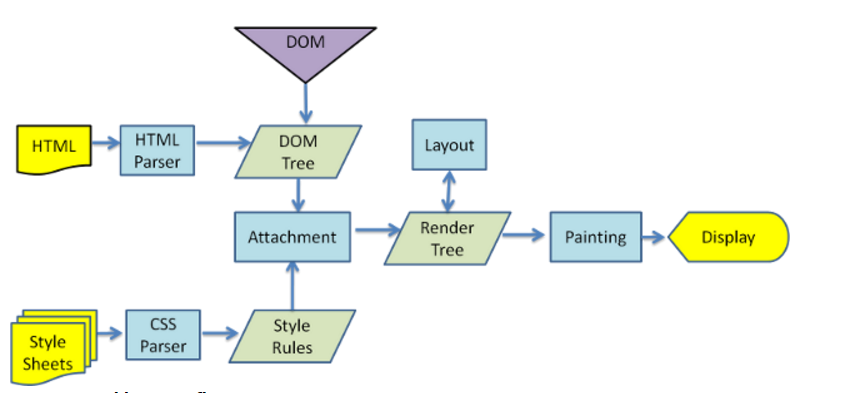

## 浏览器的渲染过程

浏览器渲染过程如下：

1. 解析 HTML，生成 DOM 树，解析 CSS，生成 CSSOM 树
2. 将 DOM 树和 CSSOM 树结合，生成渲染树(Render Tree)
3. Layout(回流):根据生成的渲染树，进行回流(Layout)，得到节点的几何信息（位置，大小）
4. Painting(重绘):根据渲染树以及回流得到的几何信息，得到节点的绝对像素
5. Display:将像素发送给 GPU，展示在页面上。

下面简要概述了浏览器完成的步骤:

1. 处理 HTML 标记并构建 DOM 树。
2. 处理 CSS 标记并构建 CSSOM 树。
3. 将 DOM 与 CSSOM 合并成一个渲染树。
4. 根据渲染树来布局，以计算每个节点的几何信息。
5. 将各个节点绘制到屏幕上。

### 生成渲染树

为了构建渲染树，浏览器主要完成了以下工作：

1. 从 DOM 树的根节点开始遍历每个可见节点。

   - 某些节点不可见（例如脚本标记 script、元标记 meta 等），因为它们不会体现在渲染输出中，所以会被忽略。

   - 某些节点通过 CSS 隐藏，因此在渲染树中也会被忽略，例如，上例中的 span 节点---不会出现在渲染树中，---因为有一个显式规则在该节点上设置了“display: none”属性。

2. 对于每个可见节点，为其找到适配的 CSSOM 规则并应用它们。

3. 发射可见节点，连同其内容和计算的样式

> Note: 简单提一句，请注意 `visibility: hidden` 与 `display: none` 是不一样的。前者隐藏元素，但元素仍占据着布局空间（即将其渲染成一个空框），而后者 (`display: none`) 将元素从渲染树中完全移除，元素既不可见，也不是布局的组成部分。

最终输出的渲染同时包含了屏幕上的所有可见内容及其样式信息。有了渲染树，我们就可以进入“布局”阶段。

布局流程的输出是一个“盒模型”，它会精确地捕获每个元素在视口内的确切位置和尺寸: 所有相对测量值都转换为屏幕上的绝对像素。

最后，既然知道了哪些节点可见、它们的计算样式以及几何信息，终于可以将这些信息传递给最后一个阶段: 将渲染树中的每个节点转换成屏幕上的实际像素。这一步通常称为“绘制”或“栅格化”。

### 参考

- [你真的了解回流和重绘吗](https://segmentfault.com/a/1190000017329980)
- [渲染树构建、布局及绘制](https://developers.google.com/web/fundamentals/performance/critical-rendering-path/render-tree-construction?hl=zh-cn)
- [jsliang 求职系列 - 22 - 回流和重绘](https://leetcode-cn.com/circle/discuss/1T3AR7/)
